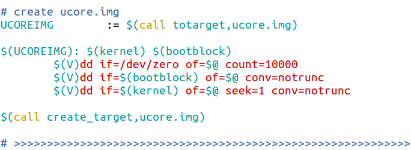

1. 

   
   
   1. 以上为Makefile文件中创建ucore.img的代码
   
      解释如下：(从上到下依次解释)(从上到下为笔者完整分析过程
   
      + ```makefile
        #先给出分析结果
        # 1、
        UCOREIMG := $(call totarget,ucore.img)	#定义变量UCOREIMG且将bin/ucore.img赋给UCOREIMG
        
        #下面为分析步骤：
        
        			#	'UCOREIMG' 	定义变量UCOREIMG
        
        			#	':=' 直接赋值、右边当前位置的值赋给左边
        
        			#	$(call totarget,ucore.img) 
        						# 将ucore.img赋值给临时变量$(1)，这个临时变量定义在totarget里面中，
        						# 返回值为ucore.img替换$(1)之后totarget定义的表达式的值
        						# 寻找totarget，查找之后发现在include引用的tools/function.mk文件里
        						# totarget变量在21行解释
        						
        include tools/function.mk	
        
          						# include关键字，告诉make去读取include包含的文件，读取结束后再继续读取Makefile						 # 文件。推理出在此文件中，在同级的tools文件夹找到此文件,找到了对应的totarget
        .SECONDEXPANSION:		
        						# 在function.mk第三行。二次扩展声明：增加一次对makefile的解析，对一些推迟
        						# 展开的变量进行展开。在此声明范围内引用变量需要多加一个$,亦即$$(var)
        
        
        totarget = $(addprefix $(BINDIR)$(SLASH),$(1))
        
          						# $(addprefix fixstring,string1 string2...)为给后面的											# string添加fixstring前缀。寻找BINDIR。$(1)指得为前面call传递的临时变量亦即						 # ucore.img、注意此时为‘=’表示不立即展开变量(以最终为准)
          						# BINDIR变量在27行，SLASH在29行
          						# 结果显而易见totarget为向ucore.img添加前缀'bin/'
        
        BINDIR	:= bin	#BINDIR为bin、寻找SLASH(英文：斜杠的意思)
        
        SLASH	:= /	#果不其然定义为 '/' 
         
        # 2、
        $(UCOREIMG): $(kernel) $(bootblock)	 # 变量UCOREIMG作为目标体、目标文件，
          									 # 变量kernel和变量bootblock为所创建目标体所依赖的文件
        $(kernel)	#寻找定义变量kernel的语句
        ```
   
      + 找到了创建kernel的代码(添加了一些注释)
   
      + ```makefile
        # create kernel target
        kernel = $(call totarget,kernel)  #定义变量kernel且将bin/kernel赋给此变量,'='表示不立即展开变量
        
        $(kernel): tools/kernel.ld	#指出kernel目标生成需要依赖tools/kernel.ld文件。其为链接器脚本，将一
        							#  个或多个输入文件合成一个输出文件，对链接器的简单解释在_else(1)里面
        
        $(kernel): $(KOBJS)	#详解在下面
        	@echo + ld $@
         	$(V)$(LD) $(LDFLAGS) -T tools/kernel.ld -o $@ $(KOBJS)
        	@$(OBJDUMP) -S $@ > $(call asmfile,kernel)
         	@$(OBJDUMP) -t $@ | $(SED) '1,/SYMBOL TABLE/d; s/ .* / /; /^$$/d' > $(call symfile,kernel)
        
        $(call create_target,kernel)
        
        # -------------------------------------------------------------------
        ```
   
        + 寻找变量KOBJS
   
        ```makefile
        									# 为了方便笔者整合了相关的语句，并按照逻辑顺序解释
        
        
        KOBJS	= $(call read_packet,kernel libs)	
        									# 在Makefile内找到了此条,解释read_packet在第
        									# kekrnel libs解释在第					
        
        
        read_packet = $(foreach p,$(call packetname,$(1)),$($(p)))	
                                            # 在function.mk找到此变量
                                            # $(foreach <var>,<list>,<text>)函数将<list>中
                                            # 单词按次序一一取出并放到<var>再执行<text>返回一
                                            # 个字符串每两个字符串之间以空格隔开，循环结束后返回
                                            # 其所组成的整个字符串(包括用作隔开的空格)
                                            # 寻找packetname，
                                            # 了解意思了：
                                            # 	 把kernel libs中的变量逐个判断并添加
                                            # 	 前缀，然后将所有的结果整合成一个字符串,待其完全展开后
                                            # 	 赋值给变量read_packet
        
        packetname = $(if $(1),$(addprefix $(OBJPREFIX),$(1)),$(OBJPREFIX))
                                            # 依旧在functional.mk文件中定义，
                                            # $(if CONDITION,THEN-PART[,ELSE-PART])函数类似
                                            # if语句。若CONDITION的展开结果为非空，意味着条件为
                                            # 真，将THEN-PART作为计算表达式；若为空，条件为假，
                                            # 将ELSE-PART(若有定义，默认为空)作为计算表达式。
                                            # OBJPREFIX解释在27行
                                            # 此处具体含义：若调用函数的call传递的临时变量$(1)
                                         	# 为空，返回值为向此变量添加前缀'__objs_'  若$(1)
                                            # 为空则返回'__objs_'
        
        OBJPREFIX	:= __objs_	
        									# 在function.mk找到了此语句，定义变量OBJPREFIX为'__objs_'
        
        
        									
        # >>>>>>>>>>>>>>>>>>>>>>>>>>>>>>>>>>>>>>>>>>>>>>>>>>>>>>>>>>>>>>>>>>>
        								# try to infer the correct GCCPREFX
      ifndef GCCPREFIX				# 推断环境中调用其安装的gcc应当使用的命令前缀
        GCCPREFIX := $(shell if i386-elf-objdump -i 2>&1 | grep '^elf32-i386$$' >/dev/null 2>&1; \
        	then echo 'i386-elf-'; \	# 首先猜测gcc命令前缀是i386-elf-
        								# 2是文件描述符，代表标准错误输出。m >& n将输出文件m和n合并
        								# 1也是文件描述符代表标准输出0为标准输入，
        								# & 是一个描述符，如果1或2前不加&，会被当成一个普通文件
        								# 2>&1  将标准错误输出重定向到标准输出
        								# '|'为管道输入右边，grep为以行为单位匹配'^elf32-i386$$'
        								# 若匹配到说明这一命令存在，echo输出'i386-elf-'
        								# 否则猜测gcc命令不包含其他前缀，继续同理上述方法测试objdump
        								# 是否存在，若存在GCCPREFIX即为''，否则输出错误，要求提供gcc
        								# 的前缀作为GCCPREFIX变量的值
        								# '>/dev/null 2>&1'为丢弃标准输出和错误输出
        								# '1>&2'  将标准输出重定向到标准错误
        	elif objdump -i 2>&1 | grep 'elf32-i386' >/dev/null 2>&1; \
        	then echo ''; \
        	else echo "***" 1>&2; \
        	echo "*** Error: Couldn't find an i386-elf version of GCC/binutils." 1>&2; \
        	echo "*** Is the directory with i386-elf-gcc in your PATH?" 1>&2; \
        	echo "*** If your i386-elf toolchain is installed with a command" 1>&2; \
        	echo "*** prefix other than 'i386-elf-', set your GCCPREFIX" 1>&2; \
        	echo "*** environment variable to that prefix and run 'make' again." 1>&2; \
        	echo "*** To turn off this error, run 'gmake GCCPREFIX= ...'." 1>&2; \
        	echo "***" 1>&2; exit 1; fi)
        endif
        # >>>>>>>>>>>>>>>>>>>>>>>>>>>
        CC		:= $(GCCPREFIX)gcc			# 编译标志
        CFLAGS  ：= 编译时的参数(有很多)
        CTYPE	:= c S
        LIBDIR	+= libs                     # 变量之前未定义，因此'+='自动变为'='
        $(call  add_files_cc,$(call listf_cc,$(LIBDIR)),libs,)
        
        									#首先解释 $(call listf_cc,$(LIBDIR))
        listf_cc = $(call listf,$(1),$(CTYPE))		
        									# 翻译：$(call listf,libs,c S)
        									# 从 'libs/*' 过滤出符合 '*.c' 或 '*.S' 的文件
        listf = $(filter $(if $(2),$(addprefix %.,$(2)),%),$(wildcard $(addsuffix $(SLASH)*,$(1))))
        									# 翻译：
        	        # $(filter $(if c S,$(addprefix %.,c S)),%),$(wildcard $(addsuffix /*,libs)))))	    # >>>>>>>>>>>>>>>>>>>>>>>>>>>>>>									
        	        						# 解释 add_files_cc
        	        						# $(1)为'libs/*'下的'*.c'或'*.S'的文件为了表示方便
        	        						# 以下用libs/*.c.S代替
        add_files_cc = $(call add_files,$(1),$(CC),$(CFLAGS) $(3),$(2),$(4))
        									# 根据上面的分析出：$(3)和$(4)为空
        									# 翻译：
        							# $(call add_files,libs/*.c.S,$(GCCPREFIX)gcc,编译参数,libs,空)
        add_files = $(eval $(call do_add_files_to_packet,$(1),$(2),$(3),$(4),$(5)))
        									# 同理：$(5)为空
        									# 翻译：
               # $(eval $(call do_add_files_to_packet,libs/*.c.S,$(GCCPREFIX)gcc,编译参数,libs,空))
        
        # 将文件添加到包中
        # add files to packet: (#files, cc[, flags, packet, dir])
        define do_add_files_to_packet		# define为定义命令序列变量，在此中引用变量需要多加个$
        									# $(1),$(2),$(3),$(4),$(5)分别为：
        									# libs/*.c.S,$(GCCPREFIX)gcc,编译参数,libs,空
        __temp_packet__ := $(call packetname,$(4))	# $(4)为libs不为空，右边返回'__objs_libs'
        ifeq ($$(origin $$(__temp_packet__)),undefined) # ifeq判断相等，此处实际为判断是否已经定义过,
        												# 若未定义赋为空。
        $$(__temp_packet__) :=
        endif											# 结束ifeq
        __temp_objs__ := $(call toobj,$(1),$(5))		# 翻译：$(call toobj,libs/*.c.S,空)
        												# 右边返回obj/libs/*.o
        $$(foreach f,$(1),$$(eval $$(call cc_template,$$(f),$(2),$(3),$(5))))
        $$(__temp_packet__) += $$(__temp_objs__)
        endef
        # >>>>>>>>>>>>>>>>>>>>
        OBJDIR	:= obj
        SLASH	:= /
        toobj = $(addprefix $(OBJDIR)$(SLASH)$(if $(2),$(2)$(SLASH)),\
        		$(addsuffix .o,$(basename $(1))))
                					# basename为从后面取出各个文件的前缀部分并返回，若无前缀返回空字符
        							# 串。$(1)为libs/*.c.S，$(2)为空因此if省去
        							# 翻译如下：
        							# $(addprefix obj/，$(addsuffix .o,$(basename libs/*.c.S))
        							# 亦即对libs/下的所有.c和.S为后缀的文件去掉后缀，添加.o为新后缀
        							# 然后再在前面添加obj/为前缀，结果为obj/libs/*.o
        # >>>>>>>>>>>>>>>>>>>
        # cc compile template, generate rule for dep, obj: (file, cc[, flags, dir])
        # cc编译模板，为依赖生成规则
        define cc_template
        $$(call todep,$(1),$(4)): $(1) | $$$$(dir $$$$@) # $(1)为前面foreach的f，$(4)为空，$(2)为														 # $(GCCPREFIX)gcc，$(3)为编译参数
        	@$(2) -I$$(dir $(1)) $(3) -MM $$< -MT "$$(patsubst %.d,%.o,$$@) $$@"> $$@
        											# 翻译：
        # $$(call todep,f,): f | $$$$(dir $$$$@) @$(GCCPREFIX)gcc  -I$$(dir f) 编译参数 -MM $$< -MT "$$(patsubst %.d,%.o,$$@) $$@"> $$@
        $$(call toobj,$(1),$(4)): $(1) | $$$$(dir $$$$@)
        	@echo + cc $$<
        	$(V)$(2) -I$$(dir $(1)) $(3) -c $$< -o $$@
        ALLOBJS += $$(call toobj,$(1),$(4))
        endef		
        
        todep = $(patsubst %.o,%.d,$(call toobj,$(1),$(2)))		
                					# $(1)为f，$(2)为空。patsubst为替换通配符查找$(call toobj,$(1),$(2))
                					# 替换%.o为%.d。亦即：将libs/*.c.S文件名序列去掉后缀并添加.o后缀和obj/前
                					# 缀为obj/libs/*.o，然后将.o后缀全部换为.d后缀
                					# 最终结果为obj/libs/*.d
                
                
        									
        									
        
        
        
        
        
        # add files to packet: (#files, cc[, flags, packet, dir])、引用变量需要多加个$
        define do_add_files_to_packet		
         __temp_packet__ := $(call packetname,$(4))		# 对上个call传递的$(4)添加前缀'__objs_'(若不为空)
        ifeq ($$(origin $$(__temp_packet__)),undefined)	# ifeq比较是否二者相同，若相同即执行endif前的语句
        $$(__temp_packet__) :=							# 若相同即执行
        endif											# 结束ifeq
        __temp_objs__ := $(call toobj,$(1),$(5))		# 
        $$(foreach f,$(1),$$(eval $$(call cc_template,$$(f),$(2),$(3),$(5))))
        $$(__temp_packet__) += $$(__temp_objs__)
        endef
        															
        
        # get .o obj files: (#files[, packet])
        toobj = $(addprefix $(OBJDIR)$(SLASH)$(if $(2),$(2)$(SLASH)),\
        		$(addsuffix .o,$(basename $(1))))
        									# $(if <condition>,<then-part>[,<else-part>])
        									# 若<condition>为真，返回<then-part>，否则返回
        									# <else-part>(若无定义，默认返回空字符串)
        									# 
        
        OBJDIR	:= obj						
        SLASH	:= /
        $(basename <names...>)				# 从文件名序列<names>取出各个文件名的前缀并返回
        									# 若不存在则返回空字符串									
        									
        ```
   ```
        
        
   
   
   ```
   
2. 

3. 

4. 

5. 

6. 

7. 

8. 

9. 

10. 

11. 

12. 

13. 

14. 

15. 

16. 

17. 

18. 

19. 

20. 

21. 

22. 

23. 简单的对kernel.ld链接器进行了解释

    ```c++
    /* Simple linker script for the JOS kernel.
       See the GNU ld 'info' manual ("info ld") to learn the syntax. */
    
    OUTPUT_FORMAT("elf32-i386", "elf32-i386", "elf32-i386")
     /*	设置输出文件的格式(大小端)，参数分别为DEFAULT,BIG,LITTLE	*/
     /*	通过objdump -i列出所有可用的二进制格式找出"elf32-i386"：
     								elf32-i386
     								(header little endian,data little endian)
     								i386	*/
    OUTPUT_ARCH(i386)
     /*	设置输出文件的体系结构machine architecture,参数为被BFD库使用的名字之一	*/
        
    ENTRY(kern_init)	
     /*	将符号kern_init的值设置为入口(可执行文件的起始代码)地址：
     	进程执行的第一条用户空间的指令在进程地址空间的地址*/
    
    SECTIONS {
    	/* Load the kernel at this address: "." means the current address */
        
    	. = 0x100000;    /*	把定位器符号置为0x100000(指定地址),若不指定默认为0 */	
        /* 	'.'是一个特殊符号，是定位器，一个位置指针，指向程序地址空间内的某位置、
        	若在SECTIONS命令内的某section的描述内时为section内的偏移),该符号只能在SECTIONS命令内使用	*/
    
    	.text : {
    		*(.text .stub .text.* .gnu.linkonce.t.*)
    	}	
        /*	'*'符号代表任意输入文件将所有输入文件的.text section和.stub section(后面的类似)
        	合并成一个.text section  
        	.text program code;
        	标志为可加载loadable(该段内的contents在运行时，亦即输出文件执行时需要加载到内存中)
        	且该section的地址为上面定位器符号指定的0x100000。    
    		顺序为第一个文件的.text section,第一个文件的.stub section,
    			   第一个文件的.text.* section,.........	*/
    
    	PROVIDE(etext = .);	/* Define the 'etext' symbol to this value */
    	/*	PROVIDE关键字定义：在目标文件内被引用，但没有在任何目标文件内被定义的符号 */
      	/*	由以上可知：exext符号对应的地址为.text section之后的第一个字节的地址	*/
        
    	.rodata : {
    		*(.rodata .rodata.* .gnu.linkonce.r.*)
    	}
    	/*	指定只读数据段，合并为一个.rodata section
    		.rodata read-only data;
    		与上面类似顺序为第一个文件的.rodata section,第一个文件的.rodata.* section,.......	*/
        
    	/* Include debugging information in kernel memory */
    	.stab : {
    		
            PROVIDE(__STAB_BEGIN__ = .);
        /*	定义符号__STAB_BEGIN__，且地址为.stab section之后的第一个字节的地址*/
    		
            *(.stab);
            
        /*	合并所有.stab section为一个.stab section*/
    		
            PROVIDE(__STAB_END__ = .);
            
            
    		BYTE(0)		/* Force the linker to allocate space
    				   for this section */
    	
        }
    
    	.stabstr : {
            
    		PROVIDE(__STABSTR_BEGIN__ = .);
        /*	定义符号__STABSTR_BEGIN__，且地址为.stabstr section之后的第一个字节的地址*/
    		
            *(.stabstr);
    		
        /*	合并所有.stabstr section为一个.stabstr section*/
            PROVIDE(__STABSTR_END__ = .);
    		BYTE(0)		/* Force the linker to allocate space
    				   for this section */
    	}
    
    	/* Adjust the address for the data segment to the next page */
    	. = ALIGN(0x1000);/*	将代码以16^3字节对齐？*/
    
    	/* The data segment */
    	.data : {
    		*(.data)
    	}
        /*	指定读写数据段
        	.data read-write initialized data;
        	将所有输入文件的.data section合并为一个.data section	*/
        
    	PROVIDE(edata = .);
      	/*	与以上类似，定义在目标文件内被引用，但没有在任何目标文件内被定义的符号
      		亦即定义符号edata，且地址为.data section之后的第一个字节的地址	*/
        
    	.bss : {
    		*(.bss)
    	}	
        /*	将所有输入文件的.bss section合并为一个.bss section
        	.bss read-write zero initialized data;
        	该section的地址被置为0x1000+.date section的大小	*/
    
    	PROVIDE(end = .);
    	/*	亦即定义符号end，且地址为.bss section之后的第一个字节的地址	*/
        
    	/DISCARD/ : {
    		*(.eh_frame .note.GNU-stack)
    	}
    }
    
    ```

    

```
#include <defs.h>
#include <x86.h>
#include <mmu.h>
#include <memlayout.h>
#include <pmm.h>

/* *
 * Task State Segment
 *任务状态段结构
 * */
static struct taskstate ts = {0};

/* *
 * Global Descriptor Table:
 *
 * The kernel and user segments are identical (except for the DPL). To load
 * the %ss register, the CPL must equal the DPL. Thus, we must duplicate the
 * segments for the user and the kernel. Defined as follows:
 *   - 0x0 :  unused (always faults -- for trapping NULL far pointers)
 *   - 0x8 :  kernel code segment
 *   - 0x10:  kernel data segment
 *   - 0x18:  user code segment
 *   - 0x20:  user data segment
 *   - 0x28:  defined for tss, initialized in gdt_init
 * */
static struct segdesc gdt[] = {
    SEG_NULL,			/*{0, 0, 0, 0, 0, 0, 0, 0, 0, 0, 0, 0, 0}*/
	[SEG_KTEXT] = SEG(STA_X | STA_R, 0x0, 0xFFFFFFFF, DPL_KERNEL),	 
    										/* 0x8内核代码段描述符 */																					/*{0xFFFF,0x0,0x0,0x8|0x2,1,(0),1,0xF,0,0,1,1,0x0}*/
    										/*{段界限,段基址,,type,G,dpl,}*/			
    [SEG_KDATA] = SEG(STA_W, 0x0, 0xFFFFFFFF, DPL_KERNEL),.			/* 内核数据段描述符 */
    [SEG_UTEXT] = SEG(STA_X | STA_R, 0x0, 0xFFFFFFFF, DPL_USER),	/* 用户代码段描述符 */
    [SEG_UDATA] = SEG(STA_W, 0x0, 0xFFFFFFFF, DPL_USER),			/*用户数据段描述符*/
    [SEG_TSS]    = SEG_NULL,										/*任务状态段描述符*/
};

static struct pseudodesc gdt_pd = {
    sizeof(gdt) - 1, (uint32_t)gdt
};

/* *
 * lgdt - load the global descriptor table register and reset the
 * data/code segement registers for kernel.
 * */
static inline void
lgdt(struct pseudodesc *pd) {
    asm volatile ("lgdt (%0)" :: "r" (pd));# 在执行代码时，不希望汇编语句被gcc优化而改变位置
    asm volatile ("movw %%ax, %%gs" :: "a" (USER_DS));	
    asm volatile ("movw %%ax, %%fs" :: "a" (USER_DS));
    asm volatile ("movw %%ax, %%es" :: "a" (KERNEL_DS));
    asm volatile ("movw %%ax, %%ds" :: "a" (KERNEL_DS));
    asm volatile ("movw %%ax, %%ss" :: "a" (KERNEL_DS));
    // reload cs
    asm volatile ("ljmp %0, $1f\n 1:\n" :: "i" (KERNEL_CS));
}

/* temporary kernel stack */
uint8_t stack0[1024];

/* gdt_init - initialize the default GDT and TSS */
static void
gdt_init(void) {
    // Setup a TSS so that we can get the right stack when we trap from
    // user to the kernel. But not safe here, it's only a temporary value,
    // it will be set to KSTACKTOP in lab2.
    ts.ts_esp0 = (uint32_t)&stack0 + sizeof(stack0);
    ts.ts_ss0 = KERNEL_DS;

    // initialize the TSS filed of the gdt
    gdt[SEG_TSS] = SEG16(STS_T32A, (uint32_t)&ts, sizeof(ts), DPL_KERNEL);
    gdt[SEG_TSS].sd_s = 0;

    // reload all segment registers
    lgdt(&gdt_pd);

    // load the TSS
    ltr(GD_TSS);
}

/* pmm_init - initialize the physical memory management */
void
pmm_init(void) {
    gdt_init();
}


```

