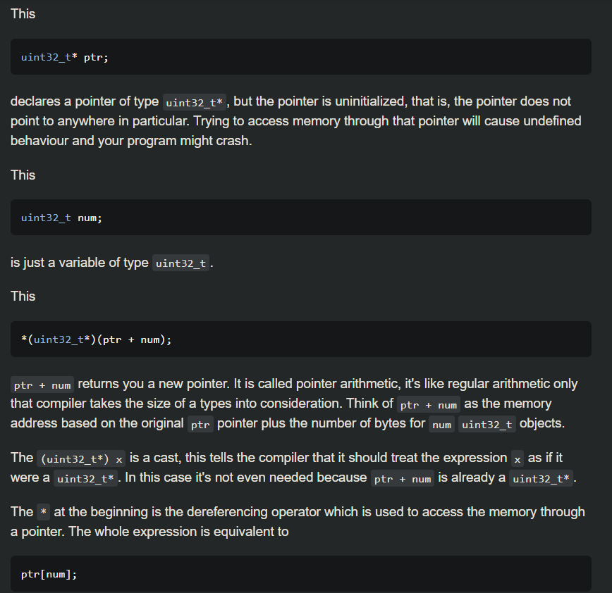
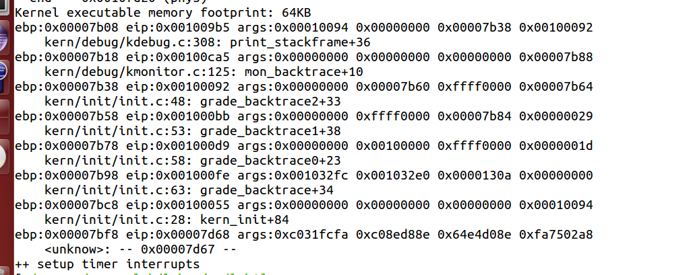
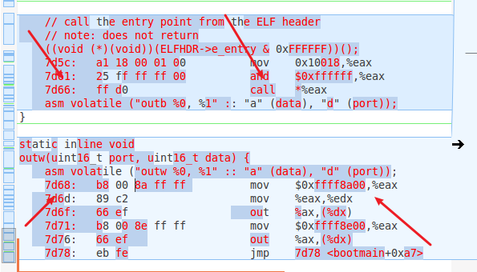
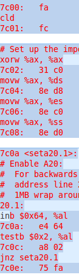

[TOC]


# 练习5

#### 练习5：实现函数调用堆栈跟踪函数 （需要编程）

我们需要在lab1中完成kdebug.c中函数print_stackframe的实现，可以通过函数print_stackframe来跟踪函数调用堆栈中记录的返回地址。在如果能够正确实现此函数，可在lab1中执行 “make qemu”后，在qemu模拟器中得到类似如下的输出：

```
……
ebp:0x00007b28 eip:0x00100992 args:0x00010094 0x00010094 0x00007b58 0x00100096
    kern/debug/kdebug.c:305: print_stackframe+22
ebp:0x00007b38 eip:0x00100c79 args:0x00000000 0x00000000 0x00000000 0x00007ba8
    kern/debug/kmonitor.c:125: mon_backtrace+10
ebp:0x00007b58 eip:0x00100096 args:0x00000000 0x00007b80 0xffff0000 0x00007b84
    kern/init/init.c:48: grade_backtrace2+33
ebp:0x00007b78 eip:0x001000bf args:0x00000000 0xffff0000 0x00007ba4 0x00000029
    kern/init/init.c:53: grade_backtrace1+38
ebp:0x00007b98 eip:0x001000dd args:0x00000000 0x00100000 0xffff0000 0x0000001d
    kern/init/init.c:58: grade_backtrace0+23
ebp:0x00007bb8 eip:0x00100102 args:0x0010353c 0x00103520 0x00001308 0x00000000
    kern/init/init.c:63: grade_backtrace+34
ebp:0x00007be8 eip:0x00100059 args:0x00000000 0x00000000 0x00000000 0x00007c53
    kern/init/init.c:28: kern_init+88
ebp:0x00007bf8 eip:0x00007d73 args:0xc031fcfa 0xc08ed88e 0x64e4d08e 0xfa7502a8
<unknow>: -- 0x00007d72 –
……
```

请完成实验，看看输出是否与上述显示大致一致，并解释最后一行各个数值的含义。

提示：可阅读小节“函数堆栈”，了解编译器如何建立函数调用关系的。在完成lab1编译后，查看lab1/obj/bootblock.asm，了解bootloader源码与机器码的语句和地址等的对应关系；查看lab1/obj/kernel.asm，了解 ucore OS源码与机器码的语句和地址等的对应关系。

要求完成函数kern/debug/kdebug.c::print_stackframe的实现，提交改进后源代码包（可以编译执行），并在实验报告中简要说明实现过程，并写出对上述问题的回答。

补充材料：

由于显示完整的栈结构需要解析内核文件中的调试符号，较为复杂和繁琐。代码中有一些辅助函数可以使用。例如可以通过调用print_debuginfo函数完成查找对应函数名并打印至屏幕的功能。具体可以参见kdebug.c代码中的注释

.

```c
ESP就是一直指向栈顶的指针,而EBP只是存取某时刻的栈顶指针,以方便对栈的操作,如获取函数参数、局部变量等。
EIP为下一条指令的内存地址
而函数调用的时候先把caller的返回地址(指的是call语句下面的那条语句！！)入栈也就是ebp[1]，当函数返回的时候先把返回地址传给eip，然后ebp本身所在的位置pop获得caller'ebp→ebp

print_stackframe(void) {
	  uint32_t *ebp = 0;
      ebp = (uint32_t *)read_ebp();
	  uint32_t eip = 0；
      eip = read_eip();
	  int i = 0;					// 编译器与c的版本不同，for循环需要提前声明i
    for (i = 0; i < STACKFRAME_DEPTH; i++) {
        if (ebp == 0) break;
    
        cprintf("ebp:0x%08x eip:0x%08x ", ebp, eip);
		//*(uint32_t *)(ebp + n) = ebp[n],相当于访问
        cprintf("args:0x%08x 0x%08x 0x%08x 0x%08x", ebp[2],ebp[3],ebp[4],ebp[5]);
        cprintf("\n");
        print_debuginfo(eip - 1);		//打印本指令的地址，eip本身存储的是下条指令地址因此'-1'
        eip = ebp[1];					//将上一层函数调用的栈顶赋给v_eip,将call的下条语句地址赋值给eip
        ebp = (uint32_t *)(*ebp);		//将上一层函数调用的栈底赋给v_ebp,将此处的ebp赋值给ebp
        // eip = ((uint32_t *)ebp)[1];
        // ebp = ((uint32_t *)ebp)[0];
    }

}
```



**解释最后一行：**

ebp:0x00007bf8 eip:0x00007d73 args:0xc031fcfa 0xc08ed88e 0x64e4d08e 0xfa7502a8

**ebp:0x00007bf8：**此时为kern_init函数的栈底地址。从初始0x7c00调用"call bootmain"，bootmain没有给kern_init传递参数

先压入返回地址ebp-4，然后压入caller's ebp此时为ebp-8指向的就是0x00007bf8亦即ebp→0x00007bf8

**eip:0x00007d68：**eip的值为kern_init函数的返回地址，bootmain函数调用kern_init对应的指令的下一条指令的内存地址，

之前的((void(\*)(void))(ELFHDR->e_enrey & 0xFFFFFF))();进入加载后的kernel，eip亦即kern_init之后的下条指令0x7d68

所以为什么mov 的地址是0x10018？？（我也解释不清楚）

**args:0xc031fcfa 0xc08ed88e 0x64e4d08e 0xfa7502a8**

此时很特殊因为bootloader的指令存储是从0x7c00开始然后栈顶也是0x7c00，又ebp是0x7df8，ebp+4为0x7dfc存的是返回地址，然后ebp+4位0x7c00!!就变成了bootloader的代码，于是后面的所谓的四个参数就是bootloader指令的前16个字节的

如图bootblock.asm小端存储：

c031fcfa, c08ed88e, 64e4d08e, fa7502a8(小端存储是高地址存的是高位，注意7c02:31→c0是从低地址到高地址)


