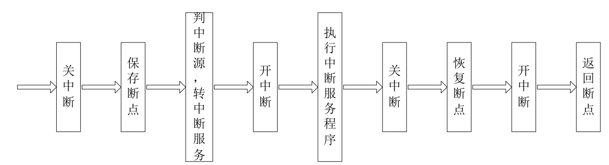
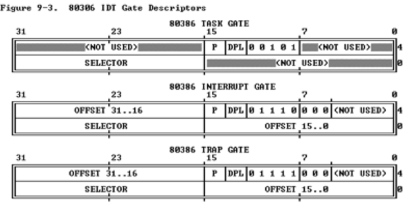
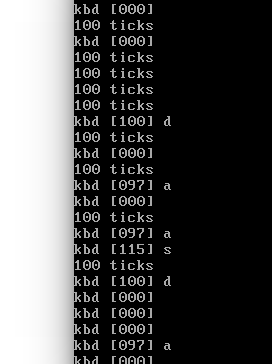

[TOC]


# 练习6

#### 练习6：完善中断初始化和处理 （需要编程）

请完成编码工作和回答如下问题：

1. 中断描述符表（也可简称为保护模式下的中断向量表）中一个表项占多少字节？其中哪几位代表中断处理代码的入口？
2. 请编程完善kern/trap/trap.c中对中断向量表进行初始化的函数idt_init。在idt_init函数中，依次对所有中断入口进行初始化。使用mmu.h中的SETGATE宏，填充idt数组内容。每个中断的入口由tools/vectors.c生成，使用trap.c中声明的vectors数组即可。
3. 请编程完善trap.c中的中断处理函数trap，在对时钟中断进行处理的部分填写trap函数中处理时钟中断的部分，使操作系统每遇到100次时钟中断后，调用print_ticks子程序，向屏幕上打印一行文字”100 ticks”。

> 【注意】除了系统调用中断(T_SYSCALL)使用陷阱门描述符且权限为用户态权限以外，其它中断均使用特权级(DPL)为０的中断门描述符，权限为内核态权限；而ucore的应用程序处于特权级３，需要采用｀int 0x80`指令操作（这种方式称为软中断，软件中断，Trap中断，在lab5会碰到）来发出系统调用请求，并要能实现从特权级３到特权级０的转换，所以系统调用中断(T_SYSCALL)所对应的中断门描述符中的特权级（DPL）需要设置为３。

要求完成问题2和问题3 提出的相关函数实现，提交改进后的源代码包（可以编译执行），并在实验报告中简要说明实现过程，并写出对问题1的回答。完成这问题2和3要求的部分代码后，运行整个系统，可以看到大约每1秒会输出一次”100 ticks”，而按下的键也会在屏幕上显示。

提示：可阅读小节“中断与异常”。




处理中断之前首先要关中断保证转中断服务的过程不被其他中断打断，要不然会形成混乱

补充：为什么系统调用中断的中断门描述符中的特权级DPL要设置为3？

​		因为访问段时特权级保护检查是max(RPL,CPL)<=DPL是否成立，而系统调用时从用户态切换到内核态，在ucoreos中用户态的特权级是3，要实现系统调用就要保证其能够请求系统调用的中断门描述符，因此设定此描述符的DPL为3。

1.  **与GDT一样，IDT的表项也是8个字节组成**(64位)，但IDT的第一项可以包含一个描述符

    80386包含3种类型的Descriptor

+   Task-gate descriptor （这里没有使用）
+   Interrupt-gate descriptor （中断方式用到）
+   Trap-gate descriptor（系统调用用到）

三种门的格式

```c
//根据图分析：高16位和低16位是段内的偏移(6-7字节和0-1字节)
//16到31位为段选择址(2-3字节)——提供寻找GDT的index
//哪几位为中断处理代码入口：48到63位，16到31位，0到15位
//步骤：1. 首先通过IDT中的段选择子到GDT找到对应段描述符，获得段的基址
//	   2. 段内偏移+基址 = 中断处理代码的入口
```

2.  从vectors.S中的'.text'知道属于text段，看之前的SEG描述符发现kernel代码段的基址为0，故此处中断入口地址直接为中断服务程序的地址。

```c
extern uintptr_t __vectors[];
// extern用在变量或函数的声明前，说明“此变量/函数是在别处定义的，要在此处引用”。uintptr_r仍然是uint32_t
int i = 0；
for(i = 0; i < sizeof(idt)/sizeof(strut gatedesc);i++){
	SETGATE(idt[i], 0, GD_KTEXT, __vectors[i], DPL_KERNEL);// 内核特权级：0
}
SETGATE(idt[T_SWITCH_TOK], 0, GD_KTEXT, __vectors[T_SWITCH_TOK], DPL_USER);
// 设置，(答案里面多出这一局，不知道为什么只设置这一个明明还有一个是T_SWITCH_TOU，但是没有设置)
// 不过GD_KTEXT是因为虽然是用户态到内核态但是仍然是到内核代码因此段选择址还是这个
lidt(&idt_pd);
/*  gcc内联汇编实现的代码
    static inline void
    lidt(struct pseudodesc *pd) {
        asm volatile ("lidt (%0)" :: "r" (pd));
    } 
*/
```

3.

```c
ticks++;
if(ticks % 100 == 0) print_ticks();
```

看图。