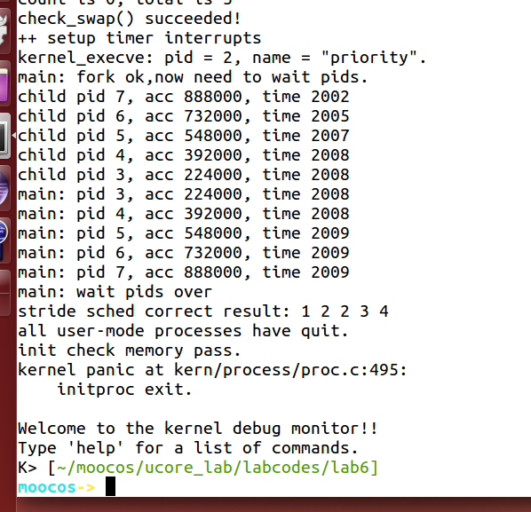

[TOC]


# 练习2: 实现 Stride Scheduling 调度算法（需要编码）

首先需要换掉RR调度器的实现，即用default_sched_stride_c覆盖default_sched.c。然后根据此文件和后续文档对Stride度器的相关描述，完成Stride调度算法的实现。

后面的实验文档部分给出了Stride调度算法的大体描述。这里给出Stride调度算法的一些相关的资料（目前网上中文的资料比较欠缺）。

-   [strid-shed paper location1](http://wwwagss.informatik.uni-kl.de/Projekte/Squirrel/stride/node3.html)
-   [strid-shed paper location2](http://citeseerx.ist.psu.edu/viewdoc/summary?doi=10.1.1.138.3502&rank=1)
-   也可GOOGLE “Stride Scheduling” 来查找相关资料

执行：make grade。如果所显示的应用程序检测都输出ok，则基本正确。如果只是priority.c过不去，可执行 make run-priority 命令来单独调试它。大致执行结果可看附录。（ 使用的是 qemu-1.0.1 ）。

请在实验报告中简要说明你的设计实现过程。


BIG_STRIDE参考：[https://yuerer.com/%E6%93%8D%E4%BD%9C%E7%B3%BB%E7%BB%9F-uCore-Lab-6/](https://yuerer.com/操作系统-uCore-Lab-6/)

```c
// 1. 如何比较优先级？为什么结果转化为有符号数就可以？*************************************************
    // 无符号数相减的结果转化为有符号数 再和0比较可判断二者大小
    /*
        eg: (溢出的)000111 - (未溢出)111111 = 001000 > 0
            (溢出的)000111 - (溢出的)000011 = 000100 > 0
            (未溢出)110111 - (未溢出)111111 = 111000 < 0
    */


#include <defs.h>
#include <list.h>
#include <proc.h>
#include <assert.h>
#include <default_sched.h>

#define USE_SKEW_HEAP 1
//2.******************************************************************
/* You should define the BigStride constant here*/
/* LAB6: YOUR CODE */
/* 从STRIDE_MAX – STRIDE_MIN <= BIG_STRIDE开始分析，
	首先前面两个刚开始是无符号的数,然后他们的差需要转化为有符号的数进行比较来判别哪个大,于是BIG_STRIDE的值就是31位的int最大值,因为32位的int最大值和31位的一样,因此是(((uint32_t)-1) >> 1)
每个进程 每次执行完以后 都要在 stride步进 += pass步长
其中 步长 是和 优先级成反比的 因此 步长可以反映出进程的优先级,但是随着每次调度 步长不断增加 有可能会有溢出的风险,因此 需要设置一个步长的最大值 使得他们哪怕溢出 还是能够进行比较
在 uCore 中 BIG_STRIDE 的值是采用 无符号32位整数表示 而 stride 也是无符号32位整数
也就是说 最大值只能为 (2^32 - 1),如果一个 进程的 stride 已经为 (2^32 -1) 时 那么再加上 pass步长 一定会溢出 然后又从0开始算.这样 整个调度算法的比较 就没有意义了
这说明 我们必须得约定一个 最大的步长 使得两个进程的步进值哪怕其中一个溢出 或者都溢出 还能够进行比较
首先 因为 步长 和 优先级成反比 可以得到下面一条
pass = BIG_STRIDE / priority <= BIG_STRIDE

进而得到
pass_max <= BIG_STRIDE

最大步长 - 最小步长 一定小于等于步长
max_stride - min_stride <= pass_max

所以得出
max_stride - min_stride <= BIG_STRIDE

前面说了 uCore 中 BIG_STRIDE 用的 无符号32位整数 最大值只能为 (2^32 - 1)
而 又因为是无符号的 因此 最小 只能为 0 而且我们需要把32位无符号整数进行比较 需要保证任意两个进程stride的差值在32位有符号数能够表示的范围之内 故 BIG_STRIDE 为 (2^32 - 1) / 2  (即有符号数的最大值)
*/
#define BIG_STRIDE    (((uint32_t)-1) >> 1)/* you should give a value, and is ??? */

/* The compare function for two skew_heap_node_t's and the
 * corresponding procs*/
// 基于第一步的解释之后,这个比较方法就很好理解了
static int
proc_stride_comp_f(void *a, void *b)
{
     struct proc_struct *p = le2proc(a, lab6_run_pool);
     struct proc_struct *q = le2proc(b, lab6_run_pool);
     int32_t c = p->lab6_stride - q->lab6_stride;
     if (c > 0) return 1;
     else if (c == 0) return 0;
     else return -1;
}


// 3.************************************************
/*
 * stride_init initializes the run-queue rq with correct assignment for
 * member variables, including:
 *
 *   - run_list: should be a empty list after initialization.
 *   - lab6_run_pool: NULL
 *   - proc_num: 0
 *   - max_time_slice: no need here, the variable would be assigned by the caller.
 *
 * hint: see libs/list.h for routines of the list structures.
 */
static void
stride_init(struct run_queue *rq) {
     /* LAB6: YOUR CODE 
      * (1) init the ready process list: rq->run_list
      * (2) init the run pool: rq->lab6_run_pool
      * (3) set number of process: rq->proc_num to 0       
      */
    list_init(&(rq->run_list));
    rq->lab6_run_pool = NULL;
    rq->proc_num = 0;
}


// 4.*******************************************************
/*
 * stride_enqueue inserts the process ``proc'' into the run-queue
 * ``rq''. The procedure should verify/initialize the relevant members
 * of ``proc'', and then put the ``lab6_run_pool'' node into the
 * queue(since we use priority queue here). The procedure should also
 * update the meta date in ``rq'' structure.
 *
 * proc->time_slice denotes the time slices allocation for the
 * process, which should set to rq->max_time_slice.
 * 
 * hint: see libs/skew_heap.h for routines of the priority
 * queue structures.
 */
static void
stride_enqueue(struct run_queue *rq, struct proc_struct *proc, proc_stride_comp_f) {
     /* LAB6: YOUR CODE 
      * (1) insert the proc into rq correctly
      * NOTICE: you can use skew_heap or list. Important functions
      *         skew_heap_insert: insert a entry into skew_heap
      *         list_add_before: insert  a entry into the last of list   
      * (2) recalculate proc->time_slice
      * (3) set proc->rq pointer to rq
      * (4) increase rq->proc_num
      */
    // 从skew_heap_insert得知init的是b也就是第二个参数,因此把第二个参数作为proc
    // skew_heap_insert返回的是新的根节点
    rq->lab6_run_pool = skew_heap_insert(rq->lab6_run_pool, &(proc->lab6_run_pool), proc_stride_comp_f);
    
    // 根据实验指导书规定proc的priority需要大于1***************************
    // proc->lab6_priority = 1;
    // if(proc->lab6_priority < 1)
    // proc->lab6_priority = 2;  
    // 测试一直过不去,看了答案发现没这句！！！
    
    // 模仿RR
    if (proc->time_slice == 0 || proc->time_slice > rq->max_time_slice) {	
  		proc->time_slice = rq->max_time_slice;
    }
    proc->rq = rq;
    (rq->proc_num)++;
}


// 5.**********************************************************
/*
 * stride_dequeue removes the process ``proc'' from the run-queue
 * ``rq'', the operation would be finished by the skew_heap_remove
 * operations. Remember to update the ``rq'' structure.
 *
 * hint: see libs/skew_heap.h for routines of the priority
 * queue structures.
 */
static void
stride_dequeue(struct run_queue *rq, struct proc_struct *proc) {
     /* LAB6: YOUR CODE 
      * (1) remove the proc from rq correctly
      * NOTICE: you can use skew_heap or list. Important functions
      *         skew_heap_remove: remove a entry from skew_heap
      *         list_del_init: remove a entry from the  list
      */
     // 根据skew_heap_remove(skew_heap_entry_t *a, skew_heap_entry_t *b,compare_f comp)的实现可知其被移除的元素
     // 是b,返回值是根节点
    rq->lab6_run_pool = skew_heap_remove(rq->lab6_run_pool, &(proc->lab6_run_pool), proc_stride_comp_f);
    (rq->proc_num)--;
}

// 6.***********************************************************
/*
 * stride_pick_next pick the element from the ``run-queue'', with the
 * minimum value of stride, and returns the corresponding process
 * pointer. The process pointer would be calculated by macro le2proc,
 * see kern/process/proc.h for definition. Return NULL if
 * there is no process in the queue.
 *
 * When one proc structure is selected, remember to update the stride
 * property of the proc. (stride += BIG_STRIDE / priority)
 *
 * hint: see libs/skew_heap.h for routines of the priority
 * queue structures.
 */
static struct proc_struct *
stride_pick_next(struct run_queue *rq) {
     /* LAB6: YOUR CODE 
      * (1) get a  proc_struct pointer p  with the minimum value of stride
             (1.1) If using skew_heap, we can use le2proc get the p from rq->lab6_run_poll
             (1.2) If using list, we have to search list to find the p with minimum stride value
      * (2) update p;s stride value: p->lab6_stride
      * (3) return p
      */
    if(rq->lab6_run_pool == NULL) return NULL;
    struct proc_struct *p = le2proc(rq->lab6_run_pool, lab6_run_pool);
    // stride_dequeue(rq, p); 不用出队吗
    // priority参考了答案,如果按照答案的话那所有的pass岂不都是1了
    if(p->lab6_priority == 0)
        	p->lab6_stride += BIG_STRIDE;
    else	p->lab6_stride += BIG_STRIDE/p->lab6_priority;
    return p;
}


// 7.**********************************************************************
/*
 * stride_proc_tick works with the tick event of current process. You
 * should check whether the time slices for current process is
 * exhausted and update the proc struct ``proc''. proc->time_slice
 * denotes the time slices left for current
 * process. proc->need_resched is the flag variable for process
 * switching.
 */
static void
stride_proc_tick(struct run_queue *rq, struct proc_struct *proc) {
     /* LAB6: YOUR CODE */
    // 模仿RR
    if (proc->time_slice > 0) {
        proc->time_slice --;
    }
    if (proc->time_slice == 0) {
        proc->need_resched = 1;
    } 
}

struct sched_class default_sched_class = {
     .name = "stride_scheduler",
     .init = stride_init,
     .enqueue = stride_enqueue,
     .dequeue = stride_dequeue,
     .pick_next = stride_pick_next,
     .proc_tick = stride_proc_tick,
};


// 然后一直不通过测试:correct result: 1 2 2 3 4 ，去piazza查了下 发现设置user/priority.c中的MAX_TIME可以修复这个问题
// 于是我把MAX_TIME改成了8000输出的结果就是1 2 3 4 5 了 通过了！！ 然后我又测试了两次 3000失败了 4000成功了!!
```



#### **tips：**

​	得出结果(make qemu的时候要等一会才出结果，我刚开始以为我错了，结果是要等几秒才出现pid什么的)