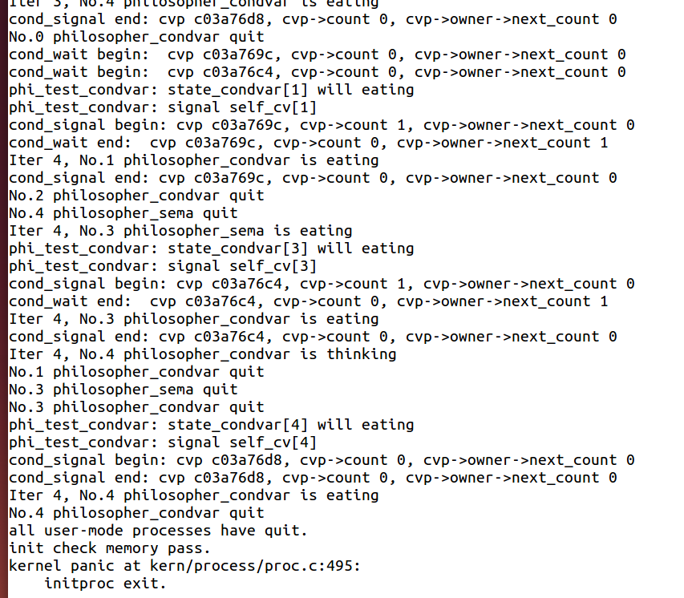

[TOC]


# **练习2: 完成内核级条件变量和基于内核级条件变量的哲学家就餐问题（需要编码）**

首先掌握管程机制，然后基于信号量实现完成条件变量实现，然后用管程机制实现哲学家就餐问题的解决方案（基于条件变量）。

执行：`make grade` 。如果所显示的应用程序检测都输出ok，则基本正确。如果只是某程序过不去，比如matrix.c，则可执行

```
make run-matrix
```

命令来单独调试它。大致执行结果可看附录。

请在实验报告中给出内核级条件变量的设计描述，并说明其大致执行流程。

请在实验报告中给出给用户态进程/线程提供条件变量机制的设计方案，并比较说明给内核级提供条件变量机制的异同。

请在实验报告中回答：能否不用基于信号量机制来完成条件变量？如果不能，请给出理由，如果能，请给出设计说明和具体实现。


### **对新增的内容一部分补充**

```c
/**************************************timer***************************************************/
typedef struct {
    unsigned int expires;       //the expire time 时间是否到了,为0就代表等待的时间到了可唤醒了
    struct proc_struct *proc;   //the proc wait in this timer. If the expire time is end, then this proc will be scheduled
    list_entry_t timer_link;    //the timer list,把timer_t和等待状态的proc连接到了一起
} timer_t;

// the list of timer
static list_entry_t timer_list;

// call scheduler to update tick related info, and check the timer is expired? If expired, then wakup proc
void
run_timer_list(void) {
    bool intr_flag;
    local_intr_save(intr_flag);	//屏蔽中断
    {
        list_entry_t *le = list_next(&timer_list);
        if (le != &timer_list) {	// 如果只有头结点  -->  没有等待进程直接还是调度current
            // 为什么是if 感觉代码有点问题，。。。。。。。。。
            timer_t *timer = le2timer(le, timer_link);	//如果有,先获取它的timer
            assert(timer->expires != 0);	// 此时必不为0
            timer->expires --;
            while (timer->expires == 0) {	// 减到0的时候
                le = list_next(le);
                struct proc_struct *proc = timer->proc;
                if (proc->wait_state != 0) {	// 若有等待原因
                    assert(proc->wait_state & WT_INTERRUPTED);// 断言能被中断,也就是这个等待原因可以被抢占？
                }
            	else {
                    // 没有原因就报错
               		warn("process %d's wait_state == 0.\n", proc->pid);
            	}
                wakeup_proc(proc);	// 唤醒进程
                del_timer(timer);	// 删除此进程对应的timer等待项
                if (le == &timer_list) {	// 如果没循环到底那就继续下一个timer循环
                    break;
                }
                timer = le2timer(le, timer_link);
            }
        }
        sched_class_proc_tick(current);	
    }
    local_intr_restore(intr_flag);
}


/********************************************wait queue*************************************************/
typedef  struct {
    struct proc_struct *proc;     //等待进程的指针
    uint32_t wakeup_flags;        //进程被放入等待队列的原因标记
    wait_queue_t *wait_queue;     //指向此wait结构所属于的wait_queue
    list_entry_t wait_link;       //用来组织wait_queue中wait节点的连接
} wait_t;

typedef struct {
    list_entry_t wait_head;       //wait_queue的队头
} wait_queue_t;

le2wait(le, member)               //实现wait_t中成员的指针向wait_t 指针的转化
```

### **练习二**

```c
// 条件变量
typedef struct condvar{
    semaphore_t sem;        
    // the sem semaphore  is used to down the waiting proc, and the signaling proc should up the waiting proc
    int count;              // the number of waiters on condvar
    monitor_t * owner;      // the owner(monitor) of this condvar
} condvar_t;

// 管程
typedef struct monitor{
    semaphore_t mutex;      
    // the mutex lock for going into the routines in monitor, should be initialized to 1
    semaphore_t next;       
    // next和next_count一起配合使用
    // the next semaphore is used to down the signaling proc itself, and the other OR wakeuped waiting proc should wake up the sleeped signaling proc.
    // next信号量用来down(P操作)正在发信号的proc本身，并且其他的or已经被唤醒的正在等待的proc应该唤醒已经睡眠的刚才发信号的这个proc
    int next_count;         // the number of of sleeped signaling proc/发出条件变量signal的线程个数
    condvar_t *cv;          // the condvars in monitor
} monitor_t;

// 条件变量相关代码补充*************************************************************************8

// Unlock one of threads waiting on the condition variable. 
void 
cond_signal (condvar_t *cvp) {
   //LAB7 EXERCISE1: YOUR CODE
   cprintf("cond_signal begin: cvp %x, cvp->count %d, cvp->owner->next_count %d\n", cvp, cvp->count, cvp->owner->next_count);  
  /*
   *      cond_signal(cv) {
   *          if(cv.count>0) {
   *             mt.next_count ++;
   *             signal(cv.sem);
   *             wait(mt.next);
   *             mt.next_count--;
   *          }
   *       }
   */
   if( cvp->count > 0 ){	// 有进程在等待这个条件变量
       cvp->owner->next_count++;	// 表示自己由于发布signal给其他进程解堵塞而将自己堵塞
       up(&(cvp->sem));				// 唤醒一个等待cv的进程
       down(&(cvp->owner->next));   // 阻塞自己
       cvp->owner->next_count--;
   }
   cprintf("cond_signal end: cvp %x, cvp->count %d, cvp->owner->next_count %d\n", cvp, cvp->count, cvp->owner->next_count);
}

// Suspend calling thread on a condition variable waiting for condition Atomically unlocks 
// mutex and suspends calling thread on conditional variable after waking up locks mutex. Notice: mp is mutex semaphore for monitor's procedures
void
cond_wait (condvar_t *cvp) {
    //LAB7 EXERCISE1: YOUR CODE
    cprintf("cond_wait begin:  cvp %x, cvp->count %d, cvp->owner->next_count %d\n", cvp, cvp->count, cvp->owner->next_count);
   /*
    *         cv.count ++;
    *         if(mt.next_count>0)
    *            signal(mt.next)
    *         else
    *            signal(mt.mutex);
    *         wait(cv.sem);
    *         cv.count --;
    */
    cvp->count++;
    if(cvp->owner->next_count > 0)	// 看是否有由于发布signal而自己阻塞的将其唤醒
        up(&(cvp->owner->next));
    else
        up(&(cvp->owner->mutex));
    down(&(cvp->sem));		// 自己等待这个条件变量
    cvp->count--;
    cprintf("cond_wait end:  cvp %x, cvp->count %d, cvp->owner->next_count %d\n", cvp, cvp->count, cvp->owner->next_count);
}


//-----------------philosopher problem using monitor ------------
/*PSEUDO CODE :philosopher problem using monitor
 * monitor dp
 * {
 *  enum {thinking, hungry, eating} state[5];
 *  condition self[5];
 *
 *  void pickup(int i) {
 *      state[i] = hungry;
 *      if ((state[(i+4)%5] != eating) && (state[(i+1)%5] != eating)) {
 *        state[i] = eating;
 *      else
 *         self[i].wait();
 *   }
 *
 *   void putdown(int i) {
 *      state[i] = thinking;
 *      if ((state[(i+4)%5] == hungry) && (state[(i+3)%5] != eating)) {
 *          state[(i+4)%5] = eating;
 *          self[(i+4)%5].signal();
 *      }
 *      if ((state[(i+1)%5] == hungry) && (state[(i+2)%5] != eating)) {
 *          state[(i+1)%5] = eating;
 *          self[(i+1)%5].signal();
 *      }
 *   }
 *
 *   void init() {
 *      for (int i = 0; i < 5; i++)
 *         state[i] = thinking;
 *   }
 * }
 */
struct proc_struct *philosopher_proc_condvar[N]; // N philosopher
int state_condvar[N];                            // the philosopher's state: EATING, HUNGARY, THINKING  
monitor_t mt, *mtp=&mt;                          // monitor

void phi_test_condvar (i) { 	// 辅助拿筷子和放筷子的实现
    if(state_condvar[i]==HUNGRY&&state_condvar[LEFT]!=EATING
            &&state_condvar[RIGHT]!=EATING) {	// 如果可以那就拿起筷子吃饭
        cprintf("phi_test_condvar: state_condvar[%d] will eating\n",i);
        state_condvar[i] = EATING ;
        cprintf("phi_test_condvar: signal self_cv[%d] \n",i);
        /*
       if( cvp->count > 0 ){	
          如果有进程在等待这个条件变量,也就是之前第一个进来的时候失败了执行了cond_wait(&(mtp->cv[i]));那我阻塞了谁把我唤醒呢？：就是旁边的两个哲学家他们会执行phi_put_forks_condvar操作然后进一步执行phi_test_condvar然后我就可以测试了
          如果测试成功那就(注意这时候不是这个哲学家进程在执行,是另一个在执行测试我这个哲学家)
          	 因此另一个哲学家测试通过了我就把它唤醒！！：up(&(cvp->sem));
          	 那我把另一个哲学家唤醒了,我自己就要阻塞了！！：down(&(cvp->owner->next))
          	 此时的next_count++就代表存在由于唤醒哲学家的而被阻塞的进程(为了保证管程的互斥)
        	cvp->owner->next_count++;
      		up(&(cvp->sem));
       		down(&(cvp->owner->next));
       		cvp->owner->next_count--;}
        	将自身等待条件变量的信号量加1,因为后面还有cond_wait
        		如果我第一次就获得了
        	然后使自己睡眠(就是吃东西)
        */
        cond_signal(&mtp->cv[i]) ;
    }
}


void phi_take_forks_condvar(int i) {
     down(&(mtp->mutex));
//--------into routine in monitor--------------
     // LAB7 EXERCISE1: YOUR CODE
     // I am hungry
     // try to get fork
//--------leave routine in monitor--------------
      
    // 因为根据philosopher_using_condvar的实现发现每一轮都要拿到一次！
      
      state_condvar[i] = HUNGRY;
      phi_test_condvar(i);
      while( state_condvar[i] != EATING )	// 刚开始写的if,后来看了参考百度什么的,都是while感觉好像while是对的,
          cond_wait(&(mtp->cv[i]));			// 如果第一次没拿到就阻塞了，然后被唤醒之后会循环再次尝试拿筷子
    
      if(mtp->next_count>0)
         up(&(mtp->next));
      else
         up(&(mtp->mutex));
}

void phi_put_forks_condvar(int i) {
     down(&(mtp->mutex));

//--------into routine in monitor--------------
     // LAB7 EXERCISE1: YOUR CODE
     // I ate over
     // test left and right neighbors
//--------leave routine in monitor--------------
     state_condvar[i] = THINKING;
     phi_test_condvar(LEFT);	// 看看左边试着拿一下
     phi_test_condvar(RIGHT); // 右边试着拿一下
     
     if(mtp->next_count>0)
        up(&(mtp->next));
     else
        up(&(mtp->mutex));
}


//---------- philosophers using monitor (condition variable) ----------------------
int philosopher_using_condvar(void * arg) { /* arg is the No. of philosopher 0~N-1*/
  
    int i, iter=0;
    i=(int)arg;
    cprintf("I am No.%d philosopher_condvar\n",i);
    while(iter++<TIMES)// 类似练习1对信号量的解释
    { /* iterate*/
        cprintf("Iter %d, No.%d philosopher_condvar is thinking\n",iter,i); /* thinking*/
        do_sleep(SLEEP_TIME);
        phi_take_forks_condvar(i); 	// 拿筷子
        /* need two forks, maybe blocked */
        cprintf("Iter %d, No.%d philosopher_condvar is eating\n",iter,i); /* eating*/
        do_sleep(SLEEP_TIME);
        phi_put_forks_condvar(i); 
        /* return two forks back*/
    }
    cprintf("No.%d philosopher_condvar quit\n",i);
    return 0;    
}
void check_sync(void){

    int i;
    //check condition variable
    monitor_init(&mt, N);
    for(i=0;i<N;i++){
        state_condvar[i]=THINKING;	// 初始均为THINKING
        int pid = kernel_thread(philosopher_using_condvar, (void *)i, 0);
        if (pid <= 0) {
            panic("create No.%d philosopher_using_condvar failed.\n");
        }
        philosopher_proc_condvar[i] = find_proc(pid);
        set_proc_name(philosopher_proc_condvar[i], "philosopher_condvar_proc");
    }
}


```


**问题回答**

感觉好像不可以,待续。。。。。。。。。。。。。

### **管程执行流程**

1.  首先哲学家们开始运行然后phi_take_forks_condvar(i);
    +   进一步去phi_test_condvar(i); 成功了最好,如果不成功那就cond_wait(&(mtp->cv[i]));
        +   如果成功了：就不会有if( cvp->count > 0 )成立。因为每个哲学家有一个条件变量我自己执行就获取了当然就不存在等待这个条件变量的进程               (注意：不是5个哲学家6个筷子 而是5个哲学家5个条件变量 一次取两个筷子！！)
        +   此外：do_sleep(SLEEP_TIME); 就餐的时候执行这个,自身睡眠一段时间，这时候就可以执行其他哲学家试着拿筷子了！！(此时没有占用管程，只有拿筷子和放筷子占用了管程)

2.  然后phi_put_forks_condvar(i); 把筷子都放下,然后依次测试旁边的哲学家能不能拿筷子,如果能拿重点就来了！！！

+   首先令这个哲学家状态变为EATING
+   然后执行重点cond_signal(&mtp->cv[i]);
    +   先判断mtp->cv[i]->count > 0,不一定 > 0因为我可能哲学家在THINKING,此时改为EATING就没用了，因为我每次拿筷子之前都会先改成HUNGRY
    +   如果 > 0，那就代表有哲学家在等条件变量也就是等着就餐！此时先令next_count++表明我要唤醒其他哲学家了唤醒之后由于保证管程互斥操作我就要睡眠了,然后up(&(mtp->cv[i]->sem));唤醒另一个哲学家!!(注意是另一个哲学家的条件变量,不是我自己的),执行down自己睡眠

最后的运行结果