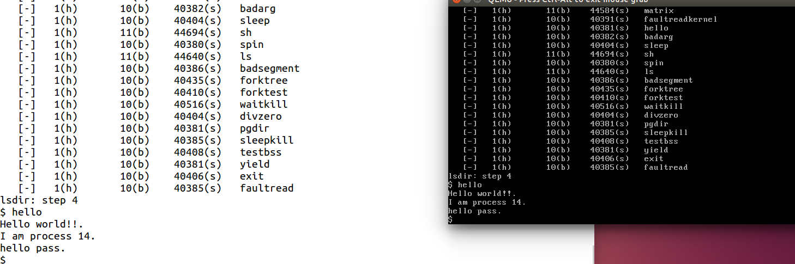

[TOC]


#### **练习2: 完成基于文件系统的执行程序机制的实现（需要编码）**

改写proc.c中的load_icode函数和其他相关函数，实现基于文件系统的执行程序机制。执行：make qemu。如果能看看到sh用户程序的执行界面，则基本成功了。如果在sh用户界面上可以执行”ls”,”hello”等其他放置在sfs文件系统中的其他执行程序，则可以认为本实验基本成功。

请在实验报告中给出设计实现基于”UNIX的硬链接和软链接机制“的概要设方案，鼓励给出详细设计方案

```c
int
do_fork(uint32_t clone_flags, uintptr_t stack, struct trapframe *tf) {
    int ret = -E_NO_FREE_PROC;
    struct proc_struct *proc;
    if (nr_process >= MAX_PROCESS) {
        goto fork_out;
    }
    ret = -E_NO_MEM;
    //LAB4:EXERCISE2 YOUR CODE
    //LAB8:EXERCISE2 YOUR CODE  HINT:how to copy the fs in parent's proc_struct?
    /*
     * Some Useful MACROs, Functions and DEFINEs, you can use them in below implementation.
     * MACROs or Functions:
     *   alloc_proc:   create a proc struct and init fields (lab4:exercise1)
     *   setup_kstack: alloc pages with size KSTACKPAGE as process kernel stack
     *   copy_mm:      process "proc" duplicate OR share process "current"'s mm according clone_flags
     *                 if clone_flags & CLONE_VM, then "share" ; else "duplicate"
     *   copy_thread:  setup the trapframe on the  process's kernel stack top and
     *                 setup the kernel entry point and stack of process
     *   hash_proc:    add proc into proc hash_list
     *   get_pid:      alloc a unique pid for process
     *   wakup_proc:   set proc->state = PROC_RUNNABLE
     * VARIABLES:
     *   proc_list:    the process set's list
     *   nr_process:   the number of process set
     */

    //    1. call alloc_proc to allocate a proc_struct
    //    2. call setup_kstack to allocate a kernel stack for child process
    //    3. call copy_mm to dup OR share mm according clone_flag
    //    4. call copy_thread to setup tf & context in proc_struct
    //    5. insert proc_struct into hash_list && proc_list
    //    6. call wakup_proc to make the new child process RUNNABLE
    //    7. set ret vaule using child proc's pid
	
	
    if ((proc = alloc_proc()) == NULL) {
        goto fork_out;
    }
	proc->parent = current;
	assert(current->wait_state == 0);

    if (setup_kstack(proc) != 0) {
        goto bad_fork_cleanup_proc;
    }
    
    // 新增******************复制父亲文件系统
    if( (ret = copy_files( clone_flags,proc->filesp)) != 0 ) 
        goto bad_fork_cleanup_fs;
    
    if (copy_mm(clone_flags, proc) != 0) {
        goto bad_fork_cleanup_kstack;
    }

    
    copy_thread(proc, stack, tf);

    bool intr_flag;
    local_intr_save(intr_flag);
    {
        proc->pid = get_pid();
        hash_proc(proc);
       // list_add(&proc_list, &(proc->list_link));
	    set_links(proc);
       // nr_process ++;
    }
    local_intr_restore(intr_flag);

    wakeup_proc(proc);
    ret = proc->pid;


	//LAB5 YOUR CODE : (update LAB4 steps)
   /* Some Functions
    *    set_links:  set the relation links of process.  ALSO SEE: remove_links:  lean the relation links of process 
    *    -------------------
	*    update step 1: set child proc's parent to current process, make sure current process's wait_state is 0
	*    update step 5: insert proc_struct into hash_list && proc_list, set the relation links of process
    */
	
fork_out:
    return ret;

bad_fork_cleanup_fs:  //for LAB8
    put_files(proc);
bad_fork_cleanup_kstack:
    put_kstack(proc);
bad_fork_cleanup_proc:
    kfree(proc);
    goto fork_out;
}


// load_icode_read is used by load_icode in LAB8
// 
static int
load_icode_read(int fd, void *buf, size_t len, off_t offset) {
    int ret;
    if ((ret = sysfile_seek(fd, offset, LSEEK_SET)) != 0) {
		// sysfile_seek找到的话就返回0  LSEEK_SET表示寻找文件的开始,判断文件是否存在
        return ret;	
    }
    if ((ret = sysfile_read(fd, buf, len)) != len) {
		// 前面可以找到就可以读文件了,读到buf里面,读完判断和要读的len是否相等,相等的话返回就是0否则非0
        return (ret < 0) ? ret : -1;
    }
    return 0;
}


// load_icode -  called by sys_exec-->do_execve
static int
load_icode(int fd, int argc, char **kargv) {
    //char *kargv[EXEC_MAX_ARG_NUM]; EXEC_MAX_ARG_NUM是32
    /* LAB8:EXERCISE2 YOUR CODE  HINT:how to load the file with handler fd  in to process's memory? how to setup argc/argv?
     * MACROs or Functions:
     *  mm_create        - create a mm
     *  setup_pgdir      - setup pgdir in mm
     *  load_icode_read  - read raw data content of program file
     *  mm_map           - build new vma
     *  pgdir_alloc_page - allocate new memory for  TEXT/DATA/BSS/stack parts
     *  lcr3             - update Page Directory Addr Register -- CR3
     */
	/* (1) create a new mm for current process
     * (2) create a new PDT, and mm->pgdir= kernel virtual addr of PDT
     * (3) copy TEXT/DATA/BSS parts in binary to memory space of process
     *    (3.1) read raw data content in file and resolve elfhdr
     *    (3.2) read raw data content in file and resolve proghdr based on info in elfhdr
     *    (3.3) call mm_map to build vma related to TEXT/DATA
     *    (3.4) callpgdir_alloc_page to allocate page for TEXT/DATA, read contents in file
     *          and copy them into the new allocated pages
     *    (3.5) callpgdir_alloc_page to allocate pages for BSS, memset zero in these pages
     * (4) call mm_map to setup user stack, and put parameters into user stack
     * (5) setup current process's mm, cr3, reset pgidr (using lcr3 MARCO)
     * (6) setup uargc and uargv in user stacks
     * (7) setup trapframe for user environment
     * (8) if up steps failed, you should cleanup the env.
     */
    // 自己3个小时写了一大半结果全错了-__-，直接拷贝答案解释把，，，，我太弱了
    
    // 为什么。。。。。
	assert(argc >= 0 && argc <= EXEC_MAX_ARG_NUM);
	
    // 前面do_execve已经清空了
    if (current->mm != NULL) {
        panic("load_icode: current->mm must be empty.\n");
    }

    
    int ret = -E_NO_MEM;
    //1. 为当前进程创建新的mm(vma虚拟内存空间的控制结构)
    struct mm_struct *mm;
    if ((mm = mm_create()) == NULL) {
        goto bad_mm;
    }
    
    //2. 创建mm的新的PDT(vma虚拟内存空间的页目录表基址)
    if (setup_pgdir(mm) != 0) {
        goto bad_pgdir_cleanup_mm;
    }
	
    //3. 把代码段数据段BSS段复制到进程的内存空间
    // 先定义一个page
    struct Page *page;
	// 3.1 定义elf文件头,定义一个指向他的指针(修改用)(奇奇怪怪)
    struct elfhdr __elf, *elf = &__elf;
    // 从file里读elfhdr结构体大小size的内容并且放到elf指向的__elf里面(正常完成就返回0)
    if ((ret = load_icode_read(fd, elf, sizeof(struct elfhdr), 0)) != 0) {
        goto bad_elf_cleanup_pgdir;// 否则就跳过去清除直接建立的pgt和mm,下面goto类似就不一一解释了
    }
	// 如果elf不符合ELF_MAGIC的规定那就有问题！
    if (elf->e_magic != ELF_MAGIC) {
        ret = -E_INVAL_ELF;
        goto bad_elf_cleanup_pgdir;
    }
	// 3.2 建立一个proghdr并且也建立一个指针用来修改(和前面类似)
    struct proghdr __ph, *ph = &__ph;
    // 虚拟空间标识,权限,程序头/段的个数
    uint32_t vm_flags, perm, phnum;
    // 逐个读取程序段
    for (phnum = 0; phnum < elf->e_phnum; phnum ++) {
        // off_t是int32,获取程序段的起始地址
        off_t phoff = elf->e_phoff + sizeof(struct proghdr) * phnum;
        
        // 向ph中加载程序段,加载成功返回值就是0
        if ((ret = load_icode_read(fd, ph, sizeof(struct proghdr), phoff)) != 0) {
            goto bad_cleanup_mmap;
        }
        
        // 判断如果是不可加载那就直接跳到下一个程序头
        if (ph->p_type != ELF_PT_LOAD) {
            continue ;
        }
        
        // 如果文件中程序段大小 > 其在内存中段大小那就出现错误(因为此时还没有加BSS段)
        if (ph->p_filesz > ph->p_memsz) {
            ret = -E_INVAL_ELF;
            goto bad_cleanup_mmap;
        }
        
        // 当然如果文件中程序段大小为0,那也直接跳到下一个程序段读了
        if (ph->p_filesz == 0) {
            continue ;
        }
        
        // 3.3 设立页表项/页目录项标志为用户,根据程序头中的flags设立虚拟空间的vm_flags
        vm_flags = 0, perm = PTE_U;
        if (ph->p_flags & ELF_PF_X) vm_flags |= VM_EXEC;
        if (ph->p_flags & ELF_PF_W) vm_flags |= VM_WRITE;
        if (ph->p_flags & ELF_PF_R) vm_flags |= VM_READ;
        if (vm_flags & VM_WRITE) perm |= PTE_W;  // 根据vm是否可写判断PTE是否可写
        
        // 给mm项创建一个vma项(存在于mmap_list构成的双向链表)
        if ((ret = mm_map(mm, ph->p_va, ph->p_memsz, vm_flags, NULL)) != 0) {
            goto bad_cleanup_mmap;
        }
        
        // 获取程序段中文件偏移位置,start为程序段虚拟地址,la是页对齐的起始地址,end是(p_filesz是文件中程序段的大小)程序段虚拟地址截止地址
        off_t offset = ph->p_offset;
        size_t off, size;
        uintptr_t start = ph->p_va, end, la = ROUNDDOWN(start, PGSIZE);

        ret = -E_NO_MEM;
		// 按照文件中段的大小设定截止地址
        end = ph->p_va + ph->p_filesz;
        // 3.4 逐个页把程序段文件(TEXT/DATA)内容读到内存
        while (start < end) {
            // 给page分配一个页然后设置物理地址和线性地址的映射(la和mm->pgdir)
            if ((page = pgdir_alloc_page(mm->pgdir, la, perm)) == NULL) {
                ret = -E_NO_MEM;
                goto bad_cleanup_mmap;
            }
            // off为页中地址偏移,size是这个页中数据大小(从off开始计算),la就变为下一个页的起始地址了
            off = start - la, size = PGSIZE - off, la += PGSIZE;
            // 如果已经超过结尾地址了,那就把size矫正一下变为size - (la - end)也就是减去后面的la和end的差值
            if (end < la) {
                size -= la - end;
            }
            // 把file里面页对其的部分page的内容整个搬到page里面
            if ((ret = load_icode_read(fd, page2kva(page) + off, size, offset)) != 0) {
                goto bad_cleanup_mmap;
            }
            // 更改start和offset(除去已经读过的部分)
            start += size, offset += size;
        }
        // end变为内存中段的截止地址
        end = ph->p_va + ph->p_memsz;
		
        // 3.5.1 如果最后一个页的内容没有填满,那就把剩余的部分全部清零分给BSS段
        if (start < la) {
            /* ph->p_memsz == ph->p_filesz */
            if (start == end) {// 如果已经读的和这个恰好相等,那就直接跳到下一程序段
                continue ;
            }
            // off是这个页中已经读数据的截止地址,size就是剩余没有数据的地方
            off = start + PGSIZE - la, size = PGSIZE - off;
            
            // 矫正size(和上面类似)
            if (end < la) {
                size -= la - end;
            }
            // 清0操作
            memset(page2kva(page) + off, 0, size);
            // start现在是页对齐的截止地址
            start += size;
            assert((end < la && start == end) || (end >= la && start == la));
        }
        
        // 3.5.2 如果BSS段(p_memsz > p_filesz)要更多空间,那就继续分配。TEXT/DATA后就是BSS段
        while (start < end) {
            if ((page = pgdir_alloc_page(mm->pgdir, la, perm)) == NULL) {
                ret = -E_NO_MEM;
                goto bad_cleanup_mmap;
            }
            off = start - la, size = PGSIZE - off, la += PGSIZE;
            if (end < la) {
                size -= la - end;
            }
            memset(page2kva(page) + off, 0, size);
            start += size;
        }
    }
    
    // 关闭文件
    sysfile_close(fd);

    vm_flags = VM_READ | VM_WRITE | VM_STACK;
    // 4. mm又创建一个vma项作为用户栈
    if ((ret = mm_map(mm, USTACKTOP - USTACKSIZE, USTACKSIZE, vm_flags, NULL)) != 0) {
        goto bad_cleanup_mmap;
    }
    
    // 给用户栈分配页并且完成pa和la映射
    assert(pgdir_alloc_page(mm->pgdir, USTACKTOP-PGSIZE , PTE_USER) != NULL);
    assert(pgdir_alloc_page(mm->pgdir, USTACKTOP-2*PGSIZE , PTE_USER) != NULL);
    assert(pgdir_alloc_page(mm->pgdir, USTACKTOP-3*PGSIZE , PTE_USER) != NULL);
    assert(pgdir_alloc_page(mm->pgdir, USTACKTOP-4*PGSIZE , PTE_USER) != NULL);
    
    // vma数量+1,将mm和当前进程连接
    mm_count_inc(mm);
    // 5. 切换到用户的内存空间，这样的话后文中在栈上设置参数部分的操作将大大简化，因为具体因为空间不足而导致的分配物理页的操作已经交由page fault处理了，是完全透明的
    current->mm = mm;
    current->cr3 = PADDR(mm->pgdir);	// 改页目录表
    lcr3(PADDR(mm->pgdir));				// 环境切换到当前进程的页表

    //6. setup argc, argv  在用户栈中设置用户的参数
    uint32_t argv_size=0, i;
    
    // 先获取参数的所有长度
    for (i = 0; i < argc; i ++) {
        argv_size += strnlen(kargv[i],EXEC_MAX_ARG_LEN + 1)+1;
    }

    // 获取栈顶user esp
    uintptr_t stacktop = USTACKTOP - (argv_size/sizeof(long)+1)*sizeof(long);
    char** uargv=(char **)(stacktop  - argc * sizeof(char *));
    
    argv_size = 0;
    // 从esp[0]依次拷贝参数到uargv
    for (i = 0; i < argc; i ++) {
        uargv[i] = strcpy((char *)(stacktop + argv_size ), kargv[i]);
        argv_size +=  strnlen(kargv[i],EXEC_MAX_ARG_LEN + 1)+1;// 最大4kB？？
    }
    // 计算当前用户栈顶(就是参数减去一个参数count,注意：栈顶是低地址)
    stacktop = (uintptr_t)uargv - sizeof(int);
    *(int *)stacktop = argc;	// 为什么Clion模拟运行不出来
    
    // 7. setup trapframe for user environment
    struct trapframe *tf = current->tf;
    memset(tf, 0, sizeof(struct trapframe));// 先初始化清零
    tf->tf_cs = USER_CS;	// 用户代码段
    tf->tf_ds = tf->tf_es = tf->tf_ss = USER_DS;	// 用户数据段
    tf->tf_esp = stacktop;	// 用户栈顶
    tf->tf_eip = elf->e_entry;	// elf的可执行代码入口
    tf->tf_eflags = FL_IF;		// 中断标志
    ret = 0;					// 一切正常置ret为0 并返回
    
out:
    return ret;
bad_cleanup_mmap:
    exit_mmap(mm);
bad_elf_cleanup_pgdir:
    put_pgdir(mm);
bad_pgdir_cleanup_mm:
    mm_destroy(mm);
bad_mm:
    goto out;    
    
    
}

```

测试一直失败。。。。。。。。。。

后来根据答案一替一个比对发现前面的lab居然还有错的。。。。然后我又改了一遍前面的答案,最后一个联系费时1天半,感觉是最难的了



#### **问题回答**

**参考**：https://cloud.tencent.com/developer/article/1480217

观察到保存在磁盘上的 inode 信息均存在一个 nlinks 变量用于表示当前文件的被链接的计数，因而支持实现硬链接和软链接机制；

-   如果在磁盘上创建一个文件 A 的软链接 B，那么将 B 当成正常的文件创建 inode，然后将 TYPE 域设置为链接，然后使用剩余的域中的一个，指向 A 的 inode 位置，然后再额外使用一个位来标记当前的链接是软链接还是硬链接；
-   当访问到文件 B（read，write 等系统调用），判断如果 B 是一个链接，则实际是将对B指向的文件A（已经知道了 A 的 inode 位置）进行操作；
-   当删除一个软链接 B 的时候，直接将其在磁盘上的 inode 删掉即可；
-   如果在磁盘上的文件 A 创建一个硬链接 B，那么在按照软链接的方法创建完 B 之后，还需要将 A 中的被链接的计数加 1；
-   访问硬链接的方式与访问软链接是一致的；
-   当删除一个硬链接B的时候，除了需要删除掉 B 的 inode 之外，还需要将 B 指向的文件 A 的被链接计数减 1，如果减到了 0，则需要将 A 删除掉；