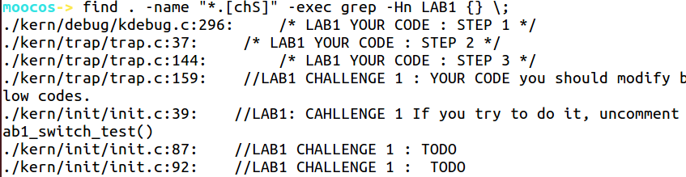
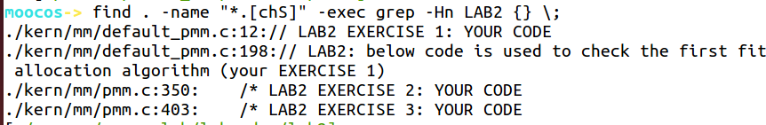

# 练习0

**练习0：填写已有实验**

本实验依赖实验1。请把你做的实验1的代码填入本实验中代码中有“LAB1”的注释相应部分。提示：可采用diff和patch工具进行半自动的合并（merge），也可用一些图形化的比较/merge工具来手动合并，比如meld，eclipse中的diff/merge工具，understand中的diff/merge工具等。

```shell
# 首先使用，找到填写之前lab1代码的位置
find . -name "*.[chS]" -exec grep -Hn LAB1 {} \;
```

。

```shell
# 依次用命令，然后手动进行代码复制
meld ../lab1/kern/debug/kdebug.c ./kern/debug/kdebug.c
....  # 命令相似，不再赘述
# 顺便找一下lab2的3个位置
find . -name "*.[chS]" -exec grep -Hn LAB2 {} \;
```

。

find . -name "*.[chS]" -exec grep -Hn LAB2{} \;