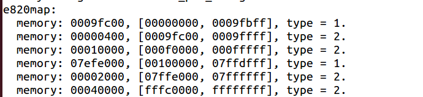
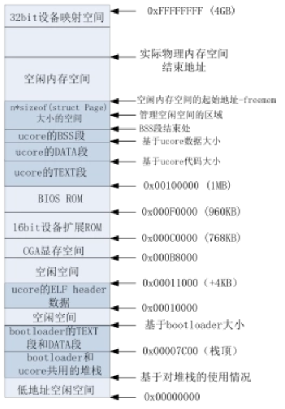
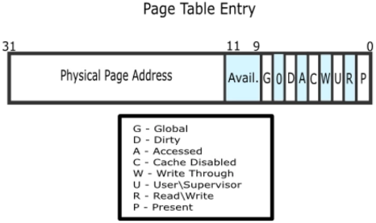
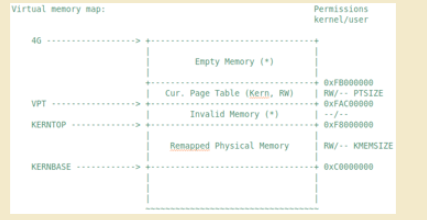
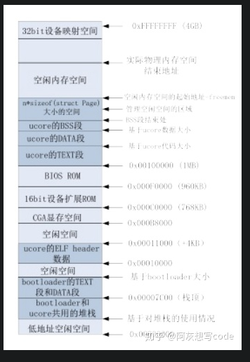

[TOC]


# 先修理解知识

+   ### ——解释一下实验指导书的部分内容

需要解决两个问题：

-   管理页级物理内存空间所需的Page结构的内存空间从哪里开始，占多大空间？
-   空闲内存空间的起始地址在哪里？

对于这两个问题，我们首先根据bootloader给出的内存布局信息找出最大的物理内存地址maxpa（定义在page_init函数中的局部变量），由于x86的起始物理内存地址为0，所以可以得知需要管理的物理页个数为

```c
npage = maxpa / PGSIZE
```

这样，我们就可以预估出管理页级物理内存空间所需的Page结构的内存空间所需的内存大小为：

```c
sizeof(struct Page) * npage
```

由于bootloader加载ucore的结束地址（用全局指针变量end记录）以上的空间没有被使用，所以我们可以把end按页大小为边界取整后，作为管理页级物理内存空间所需的Page结构的内存空间，记为：

```c
pages = (struct Page *)ROUNDUP((void *)end, PGSIZE);
//(void*)取得end的地址并变为无类型，然后对地址进行向上取整为PGSIZE的倍数，然后令一个struct Page的指针指向这个地址
```

为了简化起见，从地址0到地址pages+ sizeof(struct Page) * npage)结束的物理内存空间设定为已占用物理内存空间（起始0~640KB的空间是空闲的？为什么），地址pages+ sizeof(struct Page) * npage)以上的空间为空闲物理内存空间，这时的空闲空间起始地址为

```c
uintptr_t freemem = PADDR((uintptr_t)pages + sizeof(struct Page) * npage);
//PADDR是指减去0xc0000000的偏移，映射到物理空间
```

为此我们需要把这两部分空间给标识出来。首先，对于所有物理空间，通过如下语句即可实现占用标记：

```c
for (i = 0; i < npage; i ++) {
	SetPageReserved(pages + i);		
    // 设置每一个页的flags的bit0为1表示这个页是保留给kernel的，不可以被用户使用
    // 也就是设定为已占用物理空间
}
```

然后，根据探测到的空闲物理空间，通过如下语句即可实现空闲标记：

```c
//获得空闲空间的起始地址begin和结束地址end
...
init_memmap(pa2page(begin), (end - begin) / PGSIZE);
```

init_memmap函数则是把空闲物理页对应的Page结构中的flags(清0变为未被保留和free)和引用计数ref清零，并加到free_area.free_list指向的双向列表中，为将来的空闲页管理做好初始化准备工作。


根据ucore输出的信息和实验指导书分析：

。

1.  type=1or2
    +   type是物理内存空间的类型，1是指可以使用的物理内存空间，2是不能使用的物理内存空间。'不能使用'是指这些地址不能映射到物理内存上，但是可以映射到ROM or 映射到其他设备上，e.g. 外设

注意pages的区域和空闲内存空间的起始地址！！

```makefile
# end所指和pages的起始地址都是BSS段的结尾，freemem空闲内存空间的起始地址是管理空闲空间区域的结尾，free页的范围是freemem→实际物理内存空间结束地址
# 因此有了
pages = (struct Page *)ROUNDUP((void *)end, PGSIZE);    
# (void *)指取得地址但是不说明类型，保存了第一个物理页的页信息(页号0)
# 然后后面就可以：通过页的物理地址 >> 12得到物理页号,当做索引pages[index]就可以获得这个页的信息
# 快速获取有宏：pa2page(uintptr_t pa)

uintptr_t freemem = PADDR((uintptr_t)pages + sizeof(struct Page) * npage);

init_memmap(pa2page(begin), (end - begin) / PGSIZE);	# 初始化free页,注意此end非彼end

```

2.  

PDE和PTE,线性地址高10位为PDE的index，之后的10位为PTE的index，所以PDE和PTE都有2^10项=1024项，又每项4B，一共4KB，每个PTE和PDE都可以刚好一个物理页存放

### **地址映射三个阶段**

1.  待续。。。没时间了 还要复习考研其他科目呢

### **自映射**

1.  待续。。。

### **回顾复习**

做到lab_5的时候发现前面的la,pa,va理解有些偏差,回来复习一下

```c
//page_insert - build the map of phy addr of an Page with the linear addr la
// paramemters:
//  pgdir: the kernel virtual base address of PDT
//  page:  the Page which need to map
//  la:    the linear address need to map
//  perm:  the permission of this Page which is setted in related pte
// return value: always 0
//note: PT is changed, so the TLB need to be invalidate 
int
page_insert(pde_t *pgdir, struct Page *page, uintptr_t la, uint32_t perm) {
    pte_t *ptep = get_pte(pgdir, la, 1);	
    // pgdir是一级页表,查找PDT然后查找PT找到la对应的pte返回虚拟地址(也就是la)
    // 第三个参数置1代表如果不存在pte就创建一个page table并且返回la/va
    if (ptep == NULL) {	// 如果不存在代表内存不足,返回错误代码
        return -E_NO_MEM;
    }
    page_ref_inc(page);	// page引用加1
    if (*ptep & PTE_P) {	// 如果pte在内存
        struct Page *p = pte2page(*ptep);	// 获取pte对应的实际page
        if (p == page) {	//如果本身指向的就是这个页 ref减回去
            page_ref_dec(page);
        }
        else {	//如果本身指向的不是这个页 清除原先pte的映射 如果ref为0就顺便清除对应的物理page
            page_remove_pte(pgdir, la, ptep);
        }
    }
    *ptep = page2pa(page) | PTE_P | perm;	//建立新映射（注意PDE和PTE存的都是物理地址！！！！）
    tlb_invalidate(pgdir, la);	// 使tlb无效
    return 0;
}

/*************************************************
1. pte2page如何实现的从pte虚拟地址 to page的虚拟地址
2. page2pa 如何实现从page的虚拟地址 to page的物理地址
**************************************************/
static inline struct Page *
pte2page(pte_t pte) {
    if (!(pte & PTE_P)) {
        panic("pte2page called with invalid pte");
    }
    return pa2page(PTE_ADDR(pte));
}
// address in page table or page directory entry
#define PTE_ADDR(pte)   ((uintptr_t)(pte) & ~0xFFF)
static inline struct Page *
pa2page(uintptr_t pa) {
    if (PPN(pa) >= npage) {
        panic("pa2page called with invalid pa");
    }
    return &pages[PPN(pa)];
}

// page number field of address
#define PPN(la) (((uintptr_t)(la)) >> PTXSHIFT)			// PTXSHIFT 为 12
	/* 第一个问题回答	
		首先判断这个pte是否有对应的page——是否存在这个页表，如果存在然后返回pa2page(PTE_ADDR(pte))
			首先 PTE_ADDR(pte) 获取la的前20位(后12位清零)假定为pte_20，然后根据这个值调用pa2page(pte_20)
				首先PPN(pte_20)是指右移12位获取前20位,也就是物理空间page的页号,判断是否 >= npage
														(注意npage是size,等于的时候就代表超过了最大size-1的索引值)
				所以PPN(pte_20)就是物理页号,然后pages是初始页号的地址也就是页号0的地址,通过PPN(pte_20)作为索引值获取对应page的地址(注意page是物理内存空间的一个管理结构,看图容易理解),然后取地址&返回即可
	*/

static inline uintptr_t
page2pa(struct Page *page) {
    return page2ppn(page) << PGSHIFT;   //由于页和物理内存一一映射因此页号左移12位是页物理地址
}
static inline ppn_t
page2ppn(struct Page *page) {
    return page - pages;				//计算当前页的物理页号
}

	/* 第二个问题回答
		page结构管理整个计算的每一个物理页,其中的属性表示有的是kernel的有的是可以使用的(free)
		page - pages结果是index！！ 因为page就相当于(pages + n)，而pages是个指针,代表其后的第n个
			因此就是(pages +n) - pages = n
		首先通过page2ppn(page)获取page相对于pages的offset然后左移12位就是对应的物理页的起始地址了！！！！
	*/
// kernel自己建好了一个二级页表的映射
```

如图是之前lab2的时候kernel自己建立的虚拟空间和页表

如图,显示page结构存储的空间,也就是管理空闲空间的区域(page是管理空闲空间的),然后上面才是空闲的内存空间