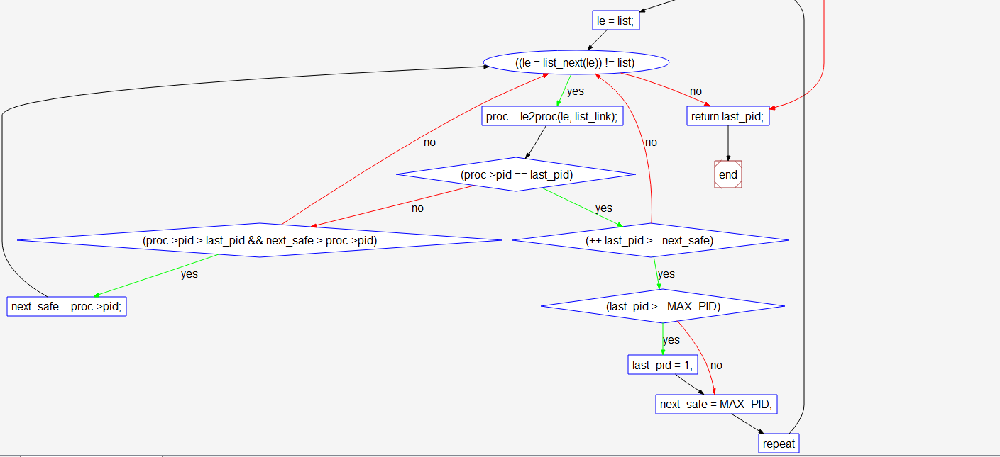

[TOC]


# 练习2：为新创建的内核线程分配资源（需要编码）

创建一个内核线程需要分配和设置好很多资源。kernel_thread函数通过调用**do_fork**函数完成具体内核线程的创建工作。do_kernel函数会调用alloc_proc函数来分配并初始化一个进程控制块，但alloc_proc只是找到了一小块内存用以记录进程的必要信息，并没有实际分配这些资源。ucore一般通过do_fork实际创建新的内核线程。do_fork的作用是，创建当前内核线程的一个副本，它们的执行上下文、代码、数据都一样，但是存储位置不同。在这个过程中，需要给新内核线程分配资源，并且复制原进程的状态。你需要完成在kern/process/proc.c中的do_fork函数中的处理过程。它的大致执行步骤包括：

-   调用alloc_proc，首先获得一块用户信息块。
-   为进程分配一个内核栈。
-   复制原进程的内存管理信息到新进程（但内核线程不必做此事）
-   复制原进程上下文到新进程
-   将新进程添加到进程列表
-   唤醒新进程
-   返回新进程号

请在实验报告中简要说明你的设计实现过程。请回答如下问题：

-   请说明ucore是否做到给每个新fork的线程一个唯一的id？请说明你的分析和理由。

```c
/* do_fork -     parent process for a new child process
 * @clone_flags: used to guide how to clone the child process
 * @stack:       the parent's user stack pointer. if stack==0, It means to fork a kernel thread.
 * @tf:          the trapframe info, which will be copied to child process's proc->tf
 */
int
do_fork(uint32_t clone_flags, uintptr_t stack, struct trapframe *tf) {
    int ret = -E_NO_FREE_PROC;	//进程or线程超过最大数量的错误代码
    struct proc_struct *proc;
    if (nr_process >= MAX_PROCESS) {	//超过最大数量直接返回前面的那个错误代码'-E_NO_FREE_PROC'
        goto fork_out;
    }
    ret = -E_NO_MEM;				//内存不足创建失败
    //LAB4:EXERCISE2 YOUR CODE
    /*
     * Some Useful MACROs, Functions and DEFINEs, you can use them in below implementation.
     * MACROs or Functions:
     *   alloc_proc:   create a proc struct and init fields (lab4:exercise1)
     *   setup_kstack: alloc pages with size KSTACKPAGE as process kernel stack
     *   copy_mm:      process "proc" duplicate OR share process "current"'s mm according clone_flags
     *                 if clone_flags & CLONE_VM, then "share" ; else "duplicate"
     *   copy_thread:  setup the trapframe on the  process's kernel stack top and
     *                 setup the kernel entry point and stack of process
     *   hash_proc:    add proc into proc hash_list
     *   get_pid:      alloc a unique pid for process
     *   wakeup_proc:  set proc->state = PROC_RUNNABLE
     * VARIABLES:
     *   proc_list:    the process set's list
     *   nr_process:   the number of process set
     */

    //    1. call alloc_proc to allocate a proc_struct
    //    2. call setup_kstack to allocate a kernel stack for child process
    //    3. call copy_mm to dup OR share mm according clone_flag
    //    4. call copy_thread to setup tf & context in proc_struct
    //    5. insert proc_struct into hash_list && proc_list
    //    6. call wakeup_proc to make the new child process RUNNABLE
    //    7. set ret vaule using child proc's pid
    if( (proc = alloc_proc()) == NULL ) goto fork_out;
    //我没想到设置下面一句
    proc->parent = current;
    if( setup_kstack(proc) != 0 ) goto bad_fork_cleanup_proc;	//此时内核堆栈分配失败直接释放proc占用的空间
    //此时内存空间分配失败需要释放之前分配的内核堆栈,然后这个执行完会执行后面的kfree(proc)释放proc占用的空间
    if( copy_mm(clone_flags, proc) != 0 ) goto bad_fork_cleanup_kstack;  
    //参考了答案：esp是stack
    copy_thread(proc, stack, tf);
    //参考了答案:关中断！！并把分配pid和加入两个list都放到关中断期间执行的代码中
    bool intr_flag;
    local_intr_save(intr_flag);
    {
    proc->pid = get_pid();
    hash_proc(proc);
    // list_add(&proc_list, &(proc->list_link));
	    set_links(proc);
    // nr_process ++;
    }
    local_intr_restore(intr_flag);	//开中断
    wakeup_proc(proc);
    ret = proc->pid;
fork_out:
    return ret;

bad_fork_cleanup_kstack:
    put_kstack(proc);
bad_fork_cleanup_proc:
    kfree(proc);
    goto fork_out;
}


```

### **问题回答**

分配的时候关中断,保证无冲突,下面就是分析具体的get_pid的代码了

```c
#define MAX_PROCESS                 4096
#define MAX_PID                     (MAX_PROCESS * 2)
// 定义了PID的数目大于PROCESS的数目,防止出现PID不够？
// 代码有点复杂,直接看流程图！！在最下面
// get_pid - alloc a unique pid for process
static int
get_pid(void) {
    static_assert(MAX_PID > MAX_PROCESS);
    struct proc_struct *proc;
    list_entry_t *list = &proc_list, *le;
    static int next_safe = MAX_PID, last_pid = MAX_PID;	
    if (++ last_pid >= MAX_PID) {
        last_pid = 1;
        goto inside;
    }
    if (last_pid >= next_safe) {
    inside:
        next_safe = MAX_PID;
    repeat:
        le = list;
        while ((le = list_next(le)) != list) {			
            proc = le2proc(le, list_link);
            if (proc->pid == last_pid) {				
                if (++ last_pid >= next_safe) {			
                    if (last_pid >= MAX_PID) {			
                        last_pid = 1;
                    }
                    next_safe = MAX_PID;
                    goto repeat;
                }
            }
            else if (proc->pid > last_pid && next_safe > proc->pid) {
                next_safe = proc->pid;
            }
        }
    }
    return last_pid;
}
```

流程图从第一个if开始

​                                                                                                                              



先把两个变量看成一个区间$[$last->pid,  nextsafe$]$,可以方便理解：

1.  首先last_pid++和MAX_PID比较,这个肯定YES,然后跳到last_pid = 1,跳到inside判断
2.  首先把next_safe设为最大MAX_PID，然后开始下面的循环判断
    1.  首先令le为list,然后对list中的proc进行轮询
        1.  如果proc->pid 恰好就是 last_pid 那现在就是proc->pid处于区间$[$last->pid,  nextsafe$]$的最左侧位置，然后就对last_pid+1,因为现在有和 last_pid 重复的pid(要保持pid的唯一)
            1.  紧接着判断last->pid是否超出了最大的限制MAX_PID，如果超出就要重新把last_pid置为1开始新一轮的轮询
            2.  如果last->pid没有超出范围，但是根据前一个判断知道last->pid超出了next_safe的范围因此把区间的右侧直接扩展到最大值——next_safe设为MAX_PID(因为之前的循环可能改变next_safe，所以它不是不变的)
        2.  如果proc->pid不是last_pid那就剩下三种情况：proc->pid在区间中(不包括端点)、在区间外(两侧共两种)
            +   然后判断是否在区间内，如果在就令next_safe为proc->pid缩小范围
    2.  根据之前的循环流程可知**last_pid**必为所需唯一pid，返回即可