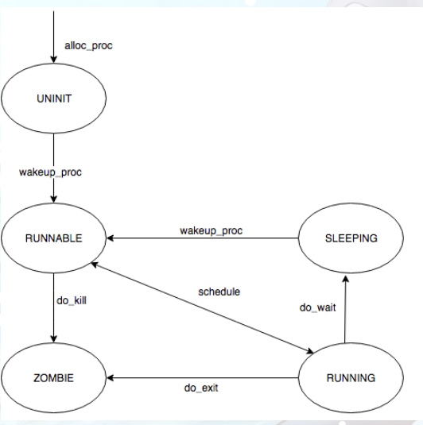
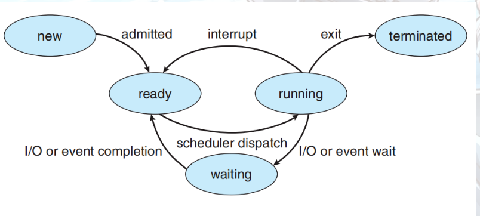

[TOC]

# **练习3: 阅读分析源代码，理解进程执行 fork/exec/wait/exit 的实现，以及系统调用的实现（不需要编码）**

请在实验报告中简要说明你对 fork/exec/wait/exit函数的分析。并回答如下问题：

-   请分析fork/exec/wait/exit在实现中是如何影响进程的执行状态的？
-   请给出ucore中一个用户态进程的执行状态生命周期图（包执行状态，执行状态之间的变换关系，以及产生变换的事件或函数调用）。（字符方式画即可）

执行：make grade。如果所显示的应用程序检测都输出ok，则基本正确。（使用的是qemu-1.0.1）

```c
int
do_fork(uint32_t clone_flags, uintptr_t stack, struct trapframe *tf) {
    int ret = -E_NO_FREE_PROC;		// init ret
    struct proc_struct *proc;		// new proc
    if (nr_process >= MAX_PROCESS) {// if number >= MAX_PROCESS(index_max is MAX_PROCESS-1)
        goto fork_out;
    }
    ret = -E_NO_MEM;	// change ret to '-E_NO_MEM'
    /*
     * Some Useful MACROs, Functions and DEFINEs, you can use them in below implementation.
     * MACROs or Functions:
     *   alloc_proc:   create a proc struct and init fields (lab4:exercise1)
     *   setup_kstack: alloc pages with size KSTACKPAGE as process kernel stack
     *   copy_mm:      process "proc" duplicate OR share process "current"'s mm according clone_flags
     *                 if clone_flags & CLONE_VM, then "share" ; else "duplicate"
     *   copy_thread:  setup the trapframe on the  process's kernel stack top and
     *                 setup the kernel entry point and stack of process
     *   hash_proc:    add proc into proc hash_list
     *   get_pid:      alloc a unique pid for process
     *   wakeup_proc:  set proc->state = PROC_RUNNABLE
     * VARIABLES:
     *   proc_list:    the process set's list
     *   nr_process:   the number of process set
     */

    //    1. call alloc_proc to allocate a proc_struct
    //    2. call setup_kstack to allocate a kernel stack for child process
    //    3. call copy_mm to dup OR share mm according clone_flag
    //    4. call copy_thread to setup tf & context in proc_struct
    //    5. insert proc_struct into hash_list && proc_list
    //    6. call wakeup_proc to make the new child process RUNNABLE
    //    7. set ret vaule using child proc's pid

	//LAB5 YOUR CODE : (update LAB4 steps)
   /* Some Functions
    *    set_links:  set the relation links of process.  ALSO SEE: remove_links:  lean the relation links of process 
    *    -------------------
	*    update step 1: set child proc's parent to current process, make sure current process's wait_state is 0
	*    update step 5: insert proc_struct into hash_list && proc_list, set the relation links of process
    */
	if( (proc = alloc_proc()) == NULL ) goto fork_out; // 分配proc结构并初始化,分配成功返回proc指针
    proc->parent = current;	
    if( setup_kstack(proc) != 0 ) goto bad_fork_cleanup_proc;	
    //此时内核堆栈分配失败直接释放proc占用的空间
    
    if( copy_mm(clone_flags, proc) != 0 ) goto bad_fork_cleanup_kstack;  
    //此时内存空间分配失败需要释放之前分配的内核堆栈,然后这个执行完会执行后面的kfree(proc)释放proc占用的空间
        
    copy_thread(proc, stack, tf);
    //设置 tf & context in proc_struct
    
    //关中断！！并把分配pid和加入两个list和set_links(proc)都放到关中断期间执行的代码中
    bool intr_flag;
    local_intr_save(intr_flag);
    {
    proc->pid = get_pid();
    hash_proc(proc);
    // list_add(&proc_list, &(proc->list_link));
	set_links(proc);		// 设置proc的链接关系和nr_process++
    // nr_process ++;
    }
    local_intr_restore(intr_flag);	//开中断
    wakeup_proc(proc);		// 唤醒proc,设置proc->state为就绪态
    ret = proc->pid;		// 返回值是子进程的proc->pid
fork_out:
    return ret;
bad_fork_cleanup_kstack:
    put_kstack(proc);
bad_fork_cleanup_proc:
    kfree(proc);
    goto fork_out;
}
// do_execve - call exit_mmap(mm)&put_pgdir(mm) to reclaim memory space of current process
//           - call load_icode to setup new memory space accroding binary prog.
int
do_execve(const char *name, size_t len, unsigned char *binary, size_t size) {
    struct mm_struct *mm = current->mm;		// 获取当前的thread的mm
    if (!user_mem_check(mm, (uintptr_t)name, len, 0)) { 	
        return -E_INVAL;
    }
    // 先判断mm：如果不为NULL代表是用户空间：先判断是否合法然后检查每个vma是否合法
    //			如果为NULL代表是内核空间(因为内核线程共享内核空间),判断是否合法
    //				合法 → 返回非0,否则返回0 →  return -E_INVAL;
    if (len > PROC_NAME_LEN) {	// 如果参数name的长度大于了规定的长度就截取name的前面部分
        len = PROC_NAME_LEN;
    }

    char local_name[PROC_NAME_LEN + 1];
    memset(local_name, 0, sizeof(local_name));
    memcpy(local_name, name, len);	// 设置name

    if (mm != NULL) {	// 如果不是NULL代表是用户进程
        lcr3(boot_cr3);	// 切换到内核态的页表
        if (mm_count_dec(mm) == 0) {	
            // exec会将当前进程替换为新的程序; (如果想要在新的进程运行, 需要连用 fork 和 exec)
            // 因此需要对当前的mm计数减1(共享mm的进程的数目)
            // 如果减1之后变0了代表可以删除了,进行一系列的删除用户进程的合法内存空间(解除pte和pde的映射,释放存在的pde),释放PDT空间,释放mm和其内容
            exit_mmap(mm);
            put_pgdir(mm);
            mm_destroy(mm);
        }
        current->mm = NULL;	// 然后初始化当前进程的mm,加载替换的就是当前进程！别忘了！
    }
    // 如果mm是NULL 那就不用初始化了
    // 所以为什么内核空间的就是NULL？
    int ret;
    if ((ret = load_icode(binary, size)) != 0) {//	加载特定程序,加载失败之前跳过去
        goto execve_exit;
    }
    set_proc_name(current, local_name);	// 设置进程名字
    return 0;

execve_exit:
    do_exit(ret);
    panic("already exit: %e.\n", ret);
}

// do_wait - wait one OR any children with PROC_ZOMBIE state, and free memory space of kernel stack
//         - proc struct of this child.
// NOTE: only after do_wait function, all resources of the child proces are free.
int
do_wait(int pid, int *code_store) {
    // pid是子进程的pid,code_store是什么？？？
    struct mm_struct *mm = current->mm;	
    if (code_store != NULL) {					// 调用do_wait的父进程的代码如果非空	
        if (!user_mem_check(mm, (uintptr_t)code_store, sizeof(int), 1)) {	// 就判断内存空间是否合法
            return -E_INVAL;
        }
    }

    struct proc_struct *proc;
    bool intr_flag, haskid;
repeat:
    haskid = 0;	
    if (pid != 0) {		// 如果pid存在
        proc = find_proc(pid);	// 找到他
        if (proc != NULL && proc->parent == current) {	// 判断此进程是否存在且父进程就是我
            haskid = 1;
            if (proc->state == PROC_ZOMBIE) {	// 如果此进程正好是ZOMBIE态那我直接跳到found
                goto found;
            }
        }
    }
    else {
        proc = current->cptr;	
        // 如果current不是pid对应proc的父亲,那就令我的孩子为proc即查询我自己的子进程并释放ZOMBIE态的资源
       
        for (; proc != NULL; proc = proc->optr) {
            haskid = 1;		
            if (proc->state == PROC_ZOMBIE) {
                goto found;	// 如果真有ZOMBIE的子进程,那就跳到found
            }
        }
    }
    if (haskid) {	// 如果存在子进程 OR 存在pid的这个process且是我的子进程
        current->state = PROC_SLEEPING;		// 父进程睡眠
        current->wait_state = WT_CHILD;		// 等待状态是等待子进程
        schedule();							// 释放CPU,执行调度程序
        if (current->flags & PF_EXITING) {	// 如果父进程处于exiting证明进程被杀了
            do_exit(-E_KILLED);				// 执行do_exit并传入'-E_KILLED'
        }
        goto repeat;		// 若未exit or return 那就repeat
    }
    return -E_BAD_PROC;		// 否则那就代表pid的proc不是我的孩子 and 我也没有子进程 那就返回把

found:
    if (proc == idleproc || proc == initproc) {	// lab4中提到在lab4之后initproc就指向第一个用户态进程
        panic("wait idleproc or initproc.\n");	// 所以为什么第一个用户态进程不能删除？lab6中老师说了这个是所有用户进程的祖先,通过它完成对没有父进程的孤儿子进程的回收工作
    }
    if (code_store != NULL) {					// 如果非空就给其赋值为子进程的exit_code
        *code_store = proc->exit_code;
    }
    local_intr_save(intr_flag);					// 关中断：hast_list除去proc,解除link关系,nr_process--
    {
        unhash_proc(proc);
        remove_links(proc);
    }
    local_intr_restore(intr_flag);				// 开中断
    put_kstack(proc);							// 释放proc内核堆栈的内存空间
    kfree(proc);								// 释放proc
    return 0;									// 释放成功 返回0
}

// do_exit - called by sys_exit
//   1. call exit_mmap & put_pgdir & mm_destroy to free the almost all memory space of process
//   2. set process' state as PROC_ZOMBIE, then call wakeup_proc(parent) to ask parent reclaim itself.
//   3. call scheduler to switch to other process
int
do_exit(int error_code) {
    if (current == idleproc) {
        panic("idleproc exit.\n");
    }
    if (current == initproc) {
        panic("initproc exit.\n");
    }
    
    struct mm_struct *mm = current->mm;
    if (mm != NULL) {
        lcr3(boot_cr3);
        if (mm_count_dec(mm) == 0) {
            exit_mmap(mm);
            put_pgdir(mm);
            mm_destroy(mm);
        }
        current->mm = NULL;
    }
    current->state = PROC_ZOMBIE;
    current->exit_code = error_code;
    
    bool intr_flag;
    struct proc_struct *proc;
    local_intr_save(intr_flag);
    {
        proc = current->parent;
        if (proc->wait_state == WT_CHILD) {
            wakeup_proc(proc);
        }
        while (current->cptr != NULL) {
            proc = current->cptr;
            current->cptr = proc->optr;
    
            proc->yptr = NULL;
            if ((proc->optr = initproc->cptr) != NULL) {
                initproc->cptr->yptr = proc;
            }
            proc->parent = initproc;
            initproc->cptr = proc;
            if (proc->state == PROC_ZOMBIE) {
                if (initproc->wait_state == WT_CHILD) {
                    wakeup_proc(initproc);
                }
            }
        }
    }
    local_intr_restore(intr_flag);
    
    schedule();
    panic("do_exit will not return!! %d.\n", current->pid);
}


```

fork流程：

$alloc\_proc$ $\rightarrow$ $setup\_kstack(proc)$ $\rightarrow$ $copy\_mm(clone\_flags, proc)$ 

$\rightarrow$ $copy\_thread(proc, stack, tf)$ $\rightarrow$ $set\ pid、list、relations(links)$ $\rightarrow$ $wakeup\_proc(proc)$ $\rightarrow$ $set\ ret = proc$->$pid$ 

exec流程：

$user\_mem\_check$ $\rightarrow$ $(len > PROC\_NAME\_LEN)$ $\rightarrow$ $set\ local\_name$ $\rightarrow$ $if\ need\ init\ mm$ $\rightarrow$ $load\_icode、set\_name$ $\rightarrow$ $return $

exec中的问题：  为什么内核空间的就是NULL？

待续。。。。。。。。

do_wait流程：

1.  根据pid找到proc,判断是否存在and是我的子进程吗，如果是就置标志haskid为1，然后看是不是ZOMBIE态，如果是就跳到found
    +   如果不是就判断是否存在子进程，如果存在就判断有无ZOMBIE态，如果有就置haskid为1然后跳到found
        +   如果没有就判断标志位haskid是否为1——是否存在符合规定的进程让我等待，如果是1就循环，否则return
2.  found：判断是不是idleproc和第一个用户态进程initproc，这两个不能删除，如果不是就是进行资源释放、解除link操作，最后删除成功return 0

do_exit流程：

1.  释放process几乎所有内存空间
2.  设置state为ZOMBIE,调用wakeup_proc(parent)唤醒父进程进行后面的回收工作
3.  运行调度程序

### **系统调用实现**

```
idt_init：
	SETGATE(idt[T_SYSCALL], 1, GD_KTEXT, __vectors[T_SYSCALL], DPL_USER);
	加载idt之前设了一个中断门/中段描述符专门用于用户态DPL_USER的触发，此后一旦用户进程执行'INT T_SYSCALL'——CPU就会从用户态切换到内核态，保存相关寄存器，并跳转到__vectors[T_SYSCALL]处开始执行
    lidt(&idt_pd);
根据实验指导书中然后有如下执行路径：
vector128(vectors.S)--\>
\_\_alltraps(trapentry.S)--\>trap(trap.c)--\>trap\_dispatch(trap.c)----\>syscall(syscall.c)-

vector128:
  pushl $0
  pushl $128
  jmp __alltraps	跳转
  
__alltraps:用于保存用户态的用户进程执行现场的trapframe的内容，设置内核数据段，调用trap(tf) (tf是一个指向之前trapframe的指针)；


trap(trap.c):处理异常or中断执行中断服务例程_dispatch(trap.c),处理完毕返回之前的状态——通过之前存储的trapframe进行CPU state的恢复，然后通过iret指令从异常返回

trap_dispatch(struct trapframe *tf):根据tf->tf_trapno判断是'T_SYSCALL'然后调用syscall()

syscall():int num = tf->tf_regs.reg_eax; num存了系统调用号。通过syscalls[num](arg)(syscalls里面存的是函数指针)调用相关的系统调用:
            static int (*syscalls[])(uint32_t arg[]) = {
                [SYS_exit]              sys_exit,
                [SYS_fork]              sys_fork,
                [SYS_wait]              sys_wait,
                [SYS_exec]              sys_exec,
                [SYS_yield]             sys_yield,
                [SYS_kill]              sys_kill,
                [SYS_getpid]            sys_getpid,
                [SYS_putc]              sys_putc,
                [SYS_pgdir]             sys_pgdir,
            };
eg: sys_exit:
		static int sys_exit(uint32_t arg[]) {
                int error_code = (int)arg[0];  	// 获取错误代码
                return do_exit(error_code);		// 调用do_exit()
            }
完成do_exit()之后os按照之前的路径回到__alltraps:
							 # pop the pushed stack pointer
   							 popl %esp				# 跳到trapret
							 # return falls through to trapret...

.globl __trapret
__trapret:
    # restore registers from stack
    popal

    # restore %ds, %es, %fs and %gs
    popl %gs
    popl %fs
    popl %es
    popl %ds

    # get rid of the trap number and error code
    addl $0x8, %esp			
    iret
    “IRET”指令后，CPU根据内核栈的情况回复到用户态，并把EIP指向tf_eip的值，即“INT T_SYSCALL”后的那条指令。这样整个系统调用就执行完毕了。
	

```

### **执行状态生命周期图**

```
-----------------------------
process state changing:
                                            
  alloc_proc                                 RUNNING
      +                                   +--<----<--+
      +                                   + proc_run +
      V                                   +-->---->--+    这个是什么？？
PROC_UNINIT -- proc_init/wakeup_proc --> PROC_RUNNABLE -- try_free_pages/do_wait/do_sleep --> PROC_SLEEPING     									   +	  +													    +
                                           +      +                                                     +										       + 	  +														+
                                           +      +--- do_exit --> PROC_ZOMBIE                          +       									   +															+
                                           -----------------------wakeup_proc-------------------------------
```

**下面参考**：https://www.cnblogs.com/ECJTUACM-873284962/p/11282776.html

