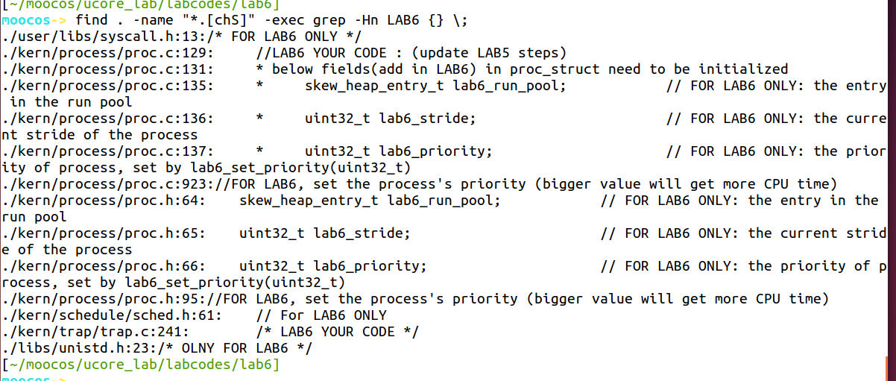

# **练习0：填写已有实验**

本实验依赖实验1/2/3/4/5。请把你做的实验2/3/4/5的代码填入本实验中代码中有“LAB1”/“LAB2”/“LAB3”/“LAB4”“LAB5”的注释相应部分。并确保编译通过。注意：为了能够正确执行lab6的测试应用程序，可能需对已完成的实验1/2/3/4/5的代码进行进一步改进。

```
在lab6目录下
meld ./ ../lab5 然后对不同的代码比较
```


lab6的某些修改

```makefile
find . -name "*.[chS]" -exec grep -Hn LAB6 {} \;    # 从结果找到需要修改的地方
```



看结果→仅仅两个地方proc.c、trap.c

```c
proc.c: alloc_proc函数 
//LAB6 YOUR CODE : (update LAB5 steps)
    /*
     * below fields(add in LAB6) in proc_struct need to be initialized
     *     struct run_queue *rq;                     // running queue contains Process
     *     list_entry_t run_link;                    // the entry linked in run queue
     *     int time_slice;                           // time slice for occupying the CPU
     *     skew_heap_entry_t lab6_run_pool;          // FOR LAB6 ONLY: the entry in the run pool
     *     uint32_t lab6_stride;                     // FOR LAB6 ONLY: the current stride of the process
     *     uint32_t lab6_priority;                   // FOR LAB6 ONLY: the priority of process, set by lab6_set_priority(uint32_t)*/
     // 很明显增加了proc的init内容
     /* 
    struct skew_heap_entry {
    struct skew_heap_entry *parent, *left, *right;};
	typedef struct skew_heap_entry skew_heap_entry_t;*/

    proc->rq = NULL;
    list_init(&(proc->run_link));		// 参考了答案，真没想到这个，，，，
    proc->time_slice = 0;
	proc->run_link.prev = proc->run_link.next = NULL;// 做到lab8才发现忘了这个......
    proc->lab6_run_pool.parent = proc->lab6_run_pool.left = proc->lab6_run_pool.right = NULL;
    proc->lab6_stride = 0;
    proc->lab6_priority = 0;

trap.c: trap_dispatch函数
    // 提示已经给出了答案：important functions：sched_class_proc_tick
    if (ticks % TICK_NUM == 0) {
        print_ticks();
	    assert( current != NULL );
        current->need_resched = 1;
        run_timer_list(); // 虚拟机里面有提示 但是我外面的静态代码没有提示
        }

```


