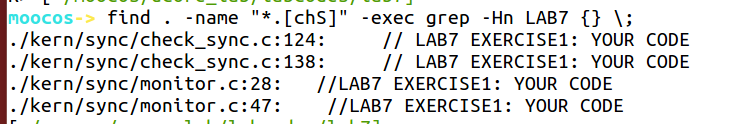

# **练习0：填写已有实验**

本实验依赖实验1/2/3/4/5/6。请把你做的实验1/2/3/4/5/6的代码填入本实验中代码中有“LAB1”/“LAB2”/“LAB3”/“LAB4”/“LAB5”/“LAB6”的注释相应部分。并确保编译通过。注意：为了能够正确执行lab7的测试应用程序，可能需对已完成的实验1/2/3/4/5/6的代码进行进一步改进。

```makefile
# shed.c中rq->max_time_slice代码lab7填的是20,但是lab6用的是MAX_TIME_SLICE
# priority.c中的MAX_TIME是2000,但是lab6设置4000才通过测试,暂时先不改

# 通过find . -name "*.[chS]" -exec grep -Hn LAB7 {} \;发现不需要更新之前6个lab的代码
```

。